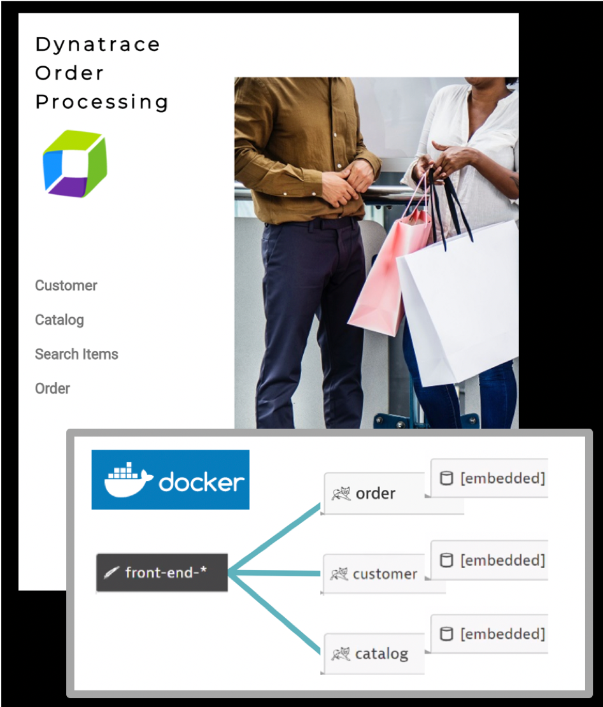
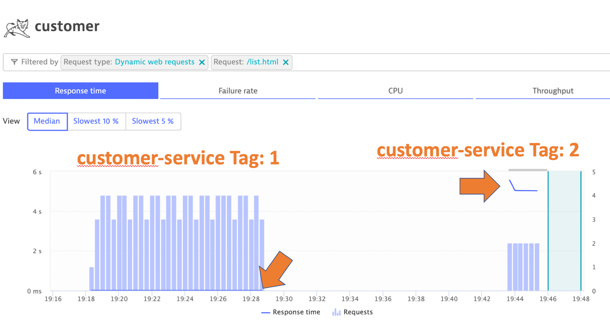
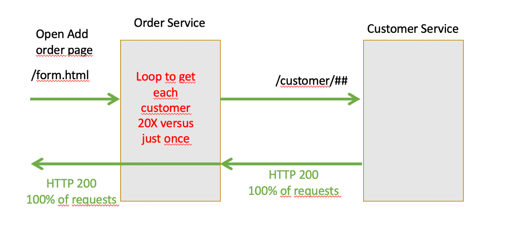
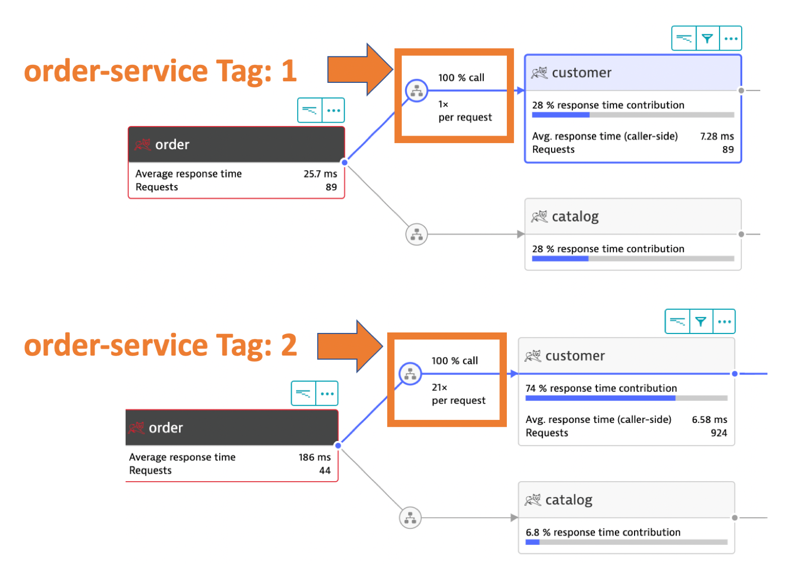
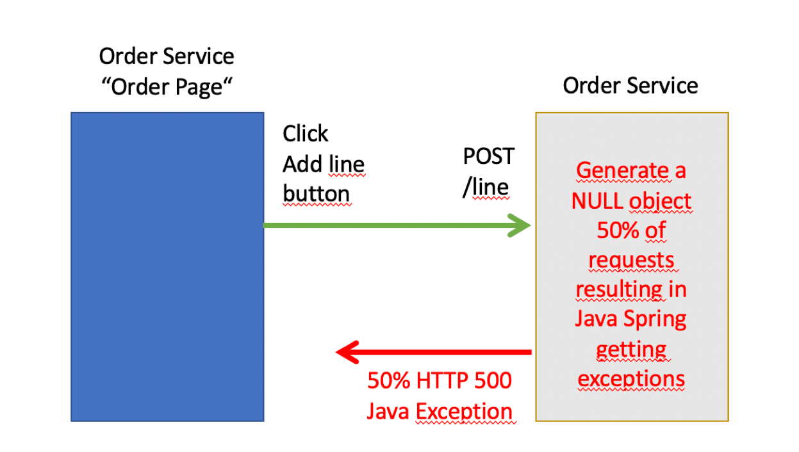
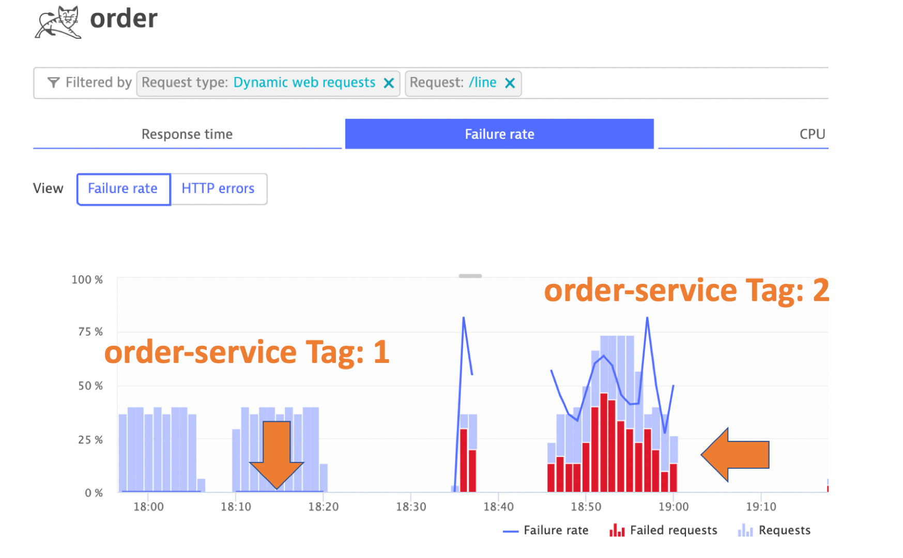

# Demo Application

The demo application is an Order processing application with 4 components: a front-end and 3 Java spring-boot backend services.

Once deployed, the front-end look like this.

Once monitored by Dynatrace, a multi-tier call flow will be available such as shown below.

# Pre-built Docker Images

The keptn-orders application has pre-built problems programmed within different versions.  See source in the [keptn-orders repo](https://github.com/keptn-orders).  Each version for each service, has pre-built docker images that are published to [docker hub](https://hub.docker.com/u/dtdemos).

This is a summary of the versions followed by a description of the problem scenarios.

| Service  | Branch/Docker Tag | Description |
|---|:---:|---|
| front-end | 1 | Normal behavior |
| catalog-service | 1 | Normal behavior |
| customer-service | 1 | Normal behavior |
| order-service | 1 | Normal behavior |
| customer-service | 2 | High Response time for /list.html |
| order-service | 2 | 50% exception for /line URL and n+1 back-end calls for /form.html |
| customer-service | 3 | Normal behavior |
| order-service | 3 | Normal behavior |

# Problem Scenarios

## Use customer-service Tag 2

## Use order-service Tag 2 

