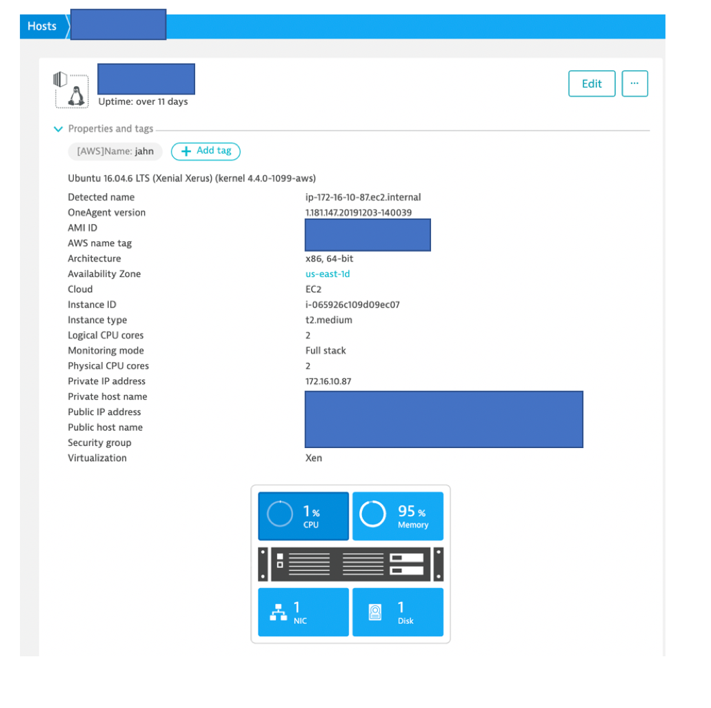
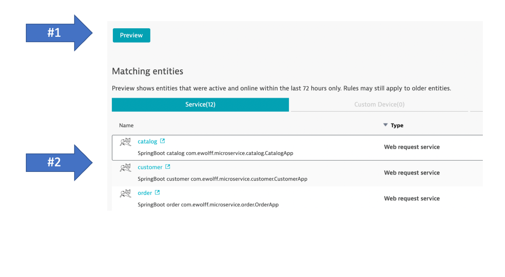

## Lab 1 Overview 

The picture below shows what we will complete in this lab.


Referring to the diagram above, learn how to:
1. Connect to the VM using a browser SSH that will be used for all the labs
1. Review the scripts and programs have been pre-installed on this VM
1. Start the demo application using docker-compose and pre-built images
1. Install Dynatrace agent against your Dyntrace tenant.

# Exercises

1. [Make a cheatsheet](make-a-cheatsheet)
1. [Connect to your VM](#Connect-to-your-VM)
1. [Install Dyntrace Agent](#Install-Dyntrace-Agent)
1. [Start the Demo Application](#Start-the-Demo-Application)
1. [Add Tags](#Add-Tags)
1. [Add Tag rule](#Add-Tag-rule)
1. [Add Management Zone](#Add-Management-Zone)

## Make a cheatsheet

We will have a number of inputs for these labs. So make a text file on your laptop. With these placeholders

```
Virtual Machine IP:
Virtual Machine login:
Virtual Machine password:

Dyntrace URL: https://[YOUR TENANT].live.dynatrace.com 
Dyntrace Token:

Jenkins URL:
Sample Application URL:
```

**NOTE be sure there is NO slash as the end of the Dynatrace URL**

## Connect to your VM

The EC2 instance is provisioned with a SSH web client tool.  This will allow you to just open your browser to the IP provided for the lab.  The login page will look like this.


Use the login credentials provided to login.  Save this information to your cheatsheet.

## Install Dyntrace Agent

1. To install Dynatrace OneAgent, first login into your Dynatrace tenant.  For example: ```https://<your tenant>.live.dynatrace.com```

1. From the left side menu, navigate to ```deploy dynatrace```

    

1. Choose ```start intallation``` button and then pick the ```Linux``` option

    

1. Copy and run the three commands to you VM

    

1. From the left side menu, navigate to ```hosts```.  You should see your host, so click on it to view the details.

    

    Note that the properties and tag automatically came from EC2.

    

## Start the Demo Application

1. Clone the hotday scripts
    ```
    cd ~
    git clone https://github.com/dynatrace-neoload-perf-workshop-infra/hotday.git
    ```

1. Run the docker-compose script and verify it is running

    ```
    # start up the application
    cd ~/hotday/lab1
    sudo docker-compose up -d

    # verify running
    sudo docker ps
    ```

1. View the demo application in a browser by navigating to

    ```http://<your Public VM IP>```

    You can you this command to get your URL:

    ```echo "http://$(curl -s http://checkip.amazonaws.com)"```

    Verify that you see version 1 for each services as shown here

    

    Save the URL to your cheatsheet.

1. Navigate around the application as to make traffic for Dynatrace to pick up.  Be sure to visit, order, customer, and search functionality.

1. Lets review what Dyntrace picked up automatically.  From the left side menu, navigate to "transactions and services". Notice how the service are hard to distinquish.

    

## Add Tags

Managing and organizing large monitoring environments is a real challenge. To effectively cope with this challenge, Dynatrace supports tags and metadata. Tags and metadata enable you to organize your monitored environments in a meaningful way. 

We will show two ways to add tags: 1) environment variables and 2) auto-tagging rules 

This exercise shows the first way of using an environment variable called ```DT_TAGS``` for the Docker container process. Dynatrace will automatically pick this [environment variable](https://www.dynatrace.com/support/help/how-to-use-dynatrace/tags-and-metadata/setup/define-tags-based-on-environment-variables/) and assign a tag.  

1. Stop the running application

    ```
    # stop up the application
    cd ~/hotday/lab1
    sudo docker-downcompose 

    # verify it is no longer running
    sudo docker ps
    ```

1. Review how we are adding these in docker compose
    ```
    cat docker-compose-with-tags.yaml
    ```

    Notice this section:
    ```
    environment:
      DT_TAGS: "app=keptn-orders"
    ```

1. start up the application with the new environment variables added.
    ```
    sudo docker-compose -f docker-compose-with-tags.yaml up -d

    # verify running
    sudo docker ps
    ```

1. Navigate around the application as to make traffic for Dynatrace to pick up.  Be sure to visit, order, customer, and search functionality.

1. Lets review what Dyntrace picked up automatically.  From the left side menu, navigate to "transactions and services". 

1. Click into one of the services and notices the tags for ```[Environment]app:keptn-orders```.  This was automatically added from an environment variable. 

    

## Add Tag rule

Lets now review a second way to add tags using auto-tagging rules.

In dynamic or large environments, manual tagging can be impractical. In such cases, it’s recommended that you use [automated, rule-based tagging](https://www.dynatrace.com/support/help/shortlink/tagging#how-to-define-an-automatically-applied-tag). Automatically applied tags behave just like the manually-applied, except they’re applied automatically to new entities that match defined rules. Automatically applied tags can’t be removed manually from individual services, process groups, process group instances, applications, or hosts. Automatically applied tags are removed automatically once an entity no longer matches a defined rule.

This Exercise shows adding a rule to use the service detected name as the tag ```service:<service name>``` based on the ```service detected name```.

1. In Dynatrace on the left menu, navigate to ```settings --> tags --> Automatically applied tags```

1. Click ```Create tag``` button and type in the name ```service``` and add a new rule with configuration as show below.

    

1. Click the ```preview``` button to verify and be sure to save the rule 

    

1. Navigate back on the ```transactions and services``` page, click into one of the services and notice the tags for ```[Environment]app:keptn-orders``` and the new tag ```service:<service name>``` created by the rule. 

    

## Add Management Zone

Now that we have tags, we can use them in many ways such as charts, API calls as a feature called Management Zones.

Management zones are a powerful information-partitioning mechanism that simultaneously promotes collaboration and the sharing of relevant team-specific data while still ensuring secure access controls.

Each customizable management zone comprises a set of monitored entities in your environment, be it hosts that share a common purpose, a specific application, a staging environment, or services of a certain technology. Management zones may overlap, just as team responsibilities often overlap. Users may be granted access to entire environments, a specific management zone, or a subset of related management zones. 

This exercise show how to add a zone that filters by the tag ```[Environment]app:keptn-orders```.

1. In Dynatrace on the left menu, navigate to ```settings --> preferences --> management zones```

1. Click ```add new management zone``` button and type in the name ```hotday``` and add a new rule with configuration as show below.

    

1. Click the ```preview``` button to verify and be sure to save the rule 

1. Navigate back on the ```transactions and services``` page, one can easy distinquish the services using the filter.

    


:arrow_forward: [Next Lab](../lab2)
