# Lab 1 Overview

In this lab, you will:
1. [Connect to your VM](#Connect-to-your-VM)
1. [Install Dynatrace OneAgent](#Install-Dynatrace-OneAgent)
1. [Start the Demo Application](#Start-the-Demo-Application)
1. [Add Tags](#Add-Tags)
1. [Add Management Zone](#Add-Management-Zone)

The picture below shows the setup for the lab environment:
1. Browser SSH client
1. Dyntrace Agent
1. Dyntrace SaaS server
1. Docker-based demo application

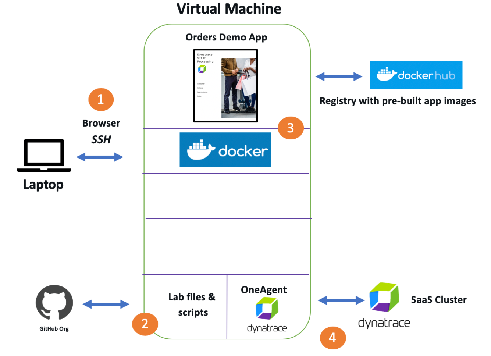

## Connect to your VM

The workshop VM instance is provisioned with an SSH web client tool.  Just open your browser to the location provided and login with the credentials provided as shown below:

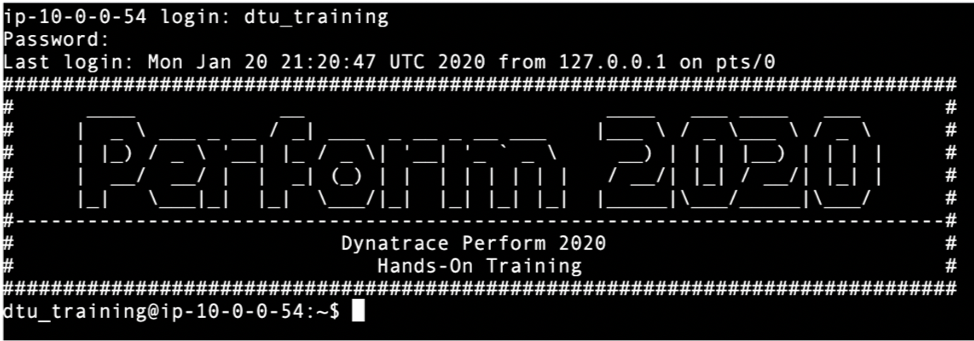

## Install Dynatrace OneAgent

1. To install Dynatrace OneAgent, first login into your Dynatrace tenant. For example: ```https://<your tenant>.sprint.dynatracelabs.com```

1. From the left side menu near the bottom, navigate to ```deploy Dynatrace```.  You should see this page

    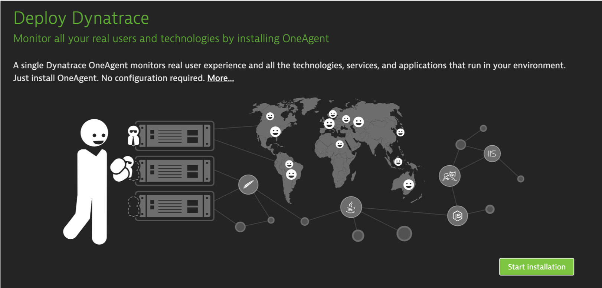

1. Click the 'start installation' button and then pick the Linux ption

    

1. Copy and run the three commands to you VM.

    NOTE: For the last one you will need to add sudo. For example:

    ```
    sudo /bin/sh Dynatrace-OneAgent-Linux-1.183.136.sh APP_LOG_CONTENT_ACCESS=1 INFRA_ONLY=0
    ```

    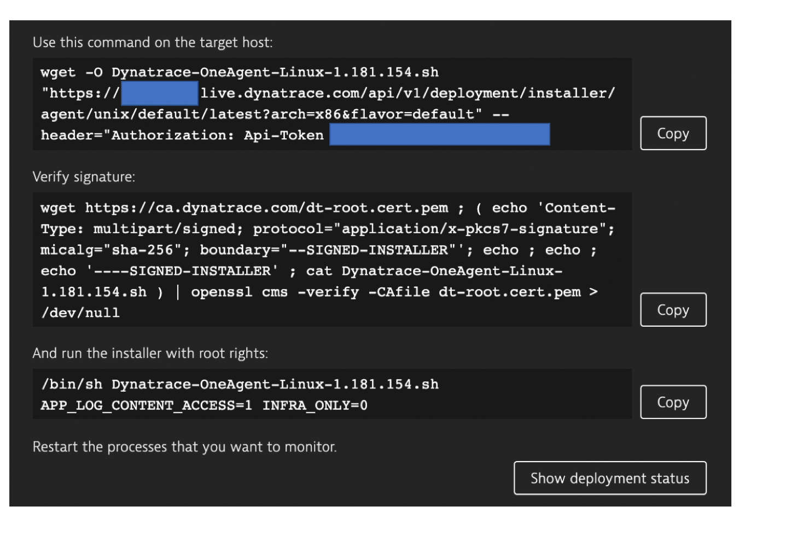


1. Back in Dynatrace from the left side menu, click on the hosts menu. You should see your host. Click on it to view the details.

    

## Start the Demo Application

The demo application runs using Docker Compose.  Docker Compose is a tool for defining and running multi-container Docker applications. With Compose, you use a YAML file to configure your application's services. See the [Application readme](../APPLICATION.md) for more details.

1. Ensure you have the latest workshop scripts by doing a git pull

    ```

    cd ~/workshop
    sudo git pull

    cd ~/scripts
    sudo git pull
    ```

1. Review the docker-compose.yaml file used for the demo application

    ```
    cd ~/workshop/lab1
    cat docker-compose.yaml
    ```

    The application will have 4 containers listening on these ports.

    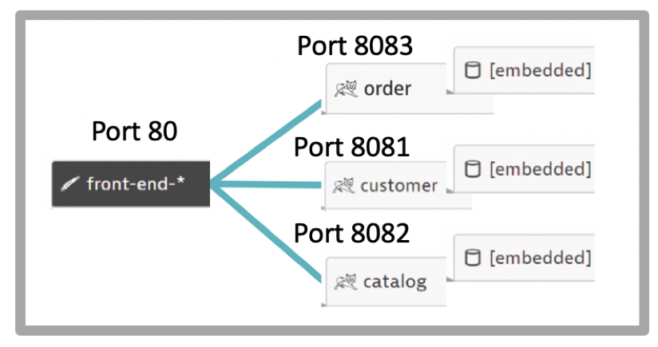

1. Run the docker-compose script to start up the application and verify it is running

    ```
    sudo docker-compose up -d
    ```

1. Verify the docker containers are running

    ```
    sudo docker ps
    ```

    You should see 4 containers running like this

    ```
    CONTAINER ID        IMAGE
    1eada6c20720        dtdemos/keptn-orders-order-service:1
    028b72624b59        dtdemos/keptn-orders-front-end:1
    fc7c00ce7a17        dtdemos/keptn-orders-catalog-:1
    63a3ef0e33aa        dtdemos/keptn-orders-customer-service:1
    ```
1. We can also verify the containers show up in Dynatrace by navigating back to the Host view.  Notice the various Tomcat processes.

    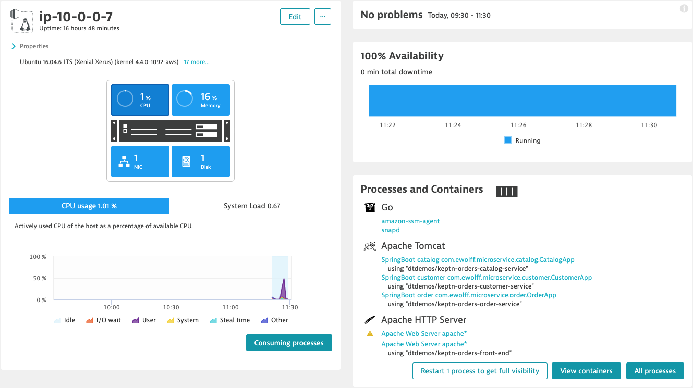

1. Get the URL to the demo application by running this command:

    ```
    echo "http://$(curl -s http://checkip.amazonaws.com)"
    ```

    It may take about a minute, but verify that you see version 1 for each service as shown here

    

1. Navigate around the application get familiar with the functionality. Be sure to visit order, customer, and search functionality.

1. Run a simple shell script to make some traffic on the site. This will loop for about 2 minutes sending requests to various pages.

    ```
    ./sendtraffic.sh
    ```

    The output will show the calls along with the HTTP status code. You should see the HTTP 200 code for each call.

    ```
    Send Traffic Test Started.

    DURATION=120 URL=http://52.40.145.74 THINKTIME=5
    calling TSN=CatalogSearchLanding; 200
    calling TSN=CatalogSearch; 200
    calling TSN=CatalogItemView; 200
    ...
    ```

1. Let's review what Dynatrace picked up automatically. From the left side menu, navigate to ```transactions and services``` and click on the ```order```  On the order service, click on the ```dynamic requests``` 

    

1. Now click on the ```View dynamic requests```  button and review the top requests by URL.

1. On the far right of the row for /line, click the ```…``` to get a menu

    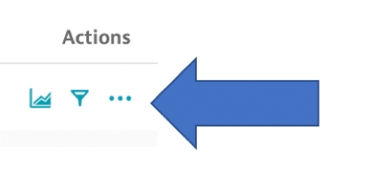

1. From the popup menu, click the ```service flow``` option and review that this reveals.

    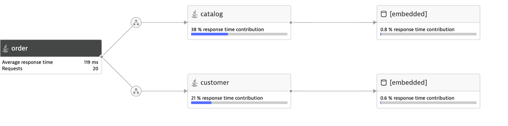

## Add Tags

Managing and organizing large monitoring environments is a real challenge. To effectively cope with this challenge, Dynatrace supports tags and metadata. Tags and metadata enable you to organize your monitored environments in a meaningful way.

Tagging can be done on each layer of the stack to provide a variety of context.  These tags we will later see are used to query and push more data to the right entity during performance testing.

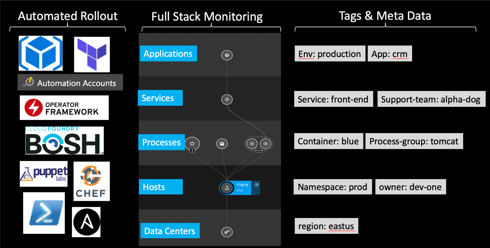


We will show two ways to add tags:

1. Environment variables
1. Auto-tagging rules

## Add Tags using Environment Variables

This exercise shows the first way of using an environment variable called ```DT_TAGS``` for the Docker container process. Dynatrace will automatically pick this environment variable and assign a tag.

1. Stop the running application

    ```
    cd ~/workshop/lab1
    sudo docker-compose down
    ```

1. verify it is no longer running

    ```
    sudo docker ps
    ```

1. Review how we are adding environment variables tags in docker compose

    ```
    cat docker-compose-with-tags.yaml
    ```

    Notice this section for the Dynatrace environment tag:

    ```
    environment:
    DT_TAGS: "app=keptn-orders"
    ```

1. start up the application with the new environment variables added.

    ```
    sudo docker-compose -f docker-compose-with-tags.yaml up -d 
    ```

1. verify running

    ```
    sudo docker ps
    ```

Navigate to the application in the browser.  It may take about a minute, but verify that you see version 1 for each service.

1. Run a simple shell script to make some traffic on the site

    ```
    cd ~/workshop/lab1
    ./sendtraffic.sh
    ```

1. Let's review what Dynatrace picked up automatically. From the left side menu, navigate to ```transactions and services```.

1. Click into one of the services and notices the tags for ```[Environment]app:keptn-orders```. This was automatically added from an environment variable.

    

## Add Tags using Auto Tagging rule

Let's now review a second way to add tags using auto-tagging rules.

In dynamic or large environments, manual tagging can be impractical. In such cases, it is recommended that you use automated, rule-based tagging. Automatically applied tags behave just like the manually-applied, except they're applied automatically to new entities that match defined rules. Automatically applied tags can't be removed manually from individual services, process groups, process group instances, applications, or hosts. Automatically applied tags are removed automatically once an entity no longer matches a defined rule.

This Exercise shows adding a rule to use the service detected name as the tag ```service:<service name>``` based on the ```service detected name```.

1. In Dynatrace on the left menu, navigate to ```settings --> tags --> Automatically applied tags```

1. Click ```Create tag``` button and type in the name ```service``` and add a new rule with configuration as show below.

    - Tag name = service
    - Optional Tag Value = {Service:DetectedName}
    - Service Tag Name = [Environment]app
    - Service Tag Value = keptn-orders

    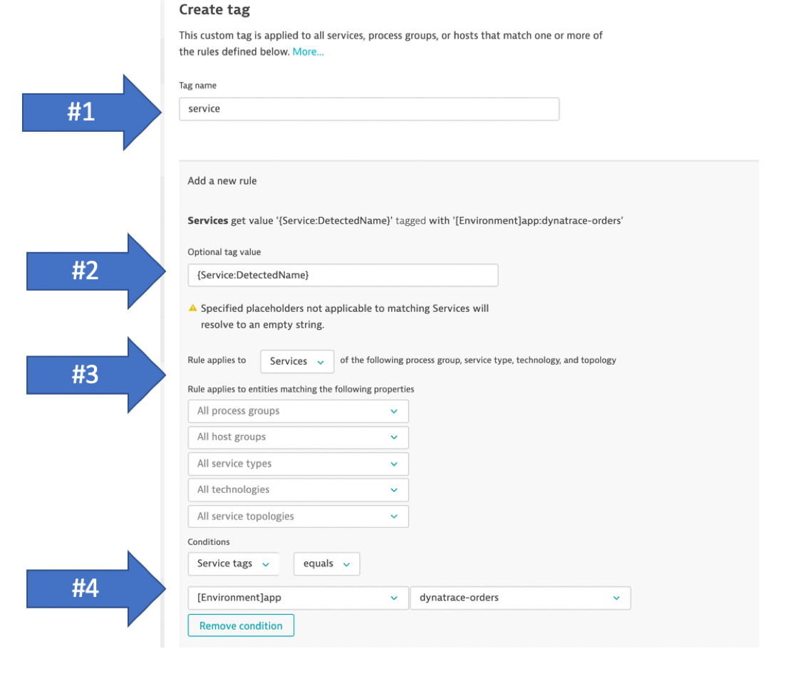

1. Click the ```preview``` button to verify.

    

1. Save the rule. Click ```create rule``` button. Then ```Save changes``` button.

    

1. Navigate back on the ```transactions and services``` page, click into one of the services and notice the tags for ```[Environment]app:keptn-orders``` and the new tag ```service:<service name>``` created by the rule.

    

## Add Management Zone

Now that we have tags, we can use them in many ways such as charts, API calls as a feature called Management Zones.

Management zones are a powerful information-partitioning mechanism that simultaneously promotes collaboration and the sharing of relevant team-specific data while still ensuring secure access controls.

Each customizable management zone comprises a set of monitored entities in your environment, be it hosts that share a common purpose, a specific application, a staging environment, or services of a certain technology. Management zones may overlap, just as team responsibilities often overlap. Users may be granted access to entire environments, a specific management zone, or a subset of related management zones.

This exercise shows how to add a zone that filters by the tag [Environment]app:keptn-orders.

1. In Dynatrace on the left menu, navigate to ```settings --> preferences --> management zones```

1. Click ```add new management zone``` button and type in the name ```hotday``` and add a new rule with configuration as show below.

    - Management zone name = keptn-orders
    - Service tag = [Environment]app
    - Service tag name = keptn-orders

    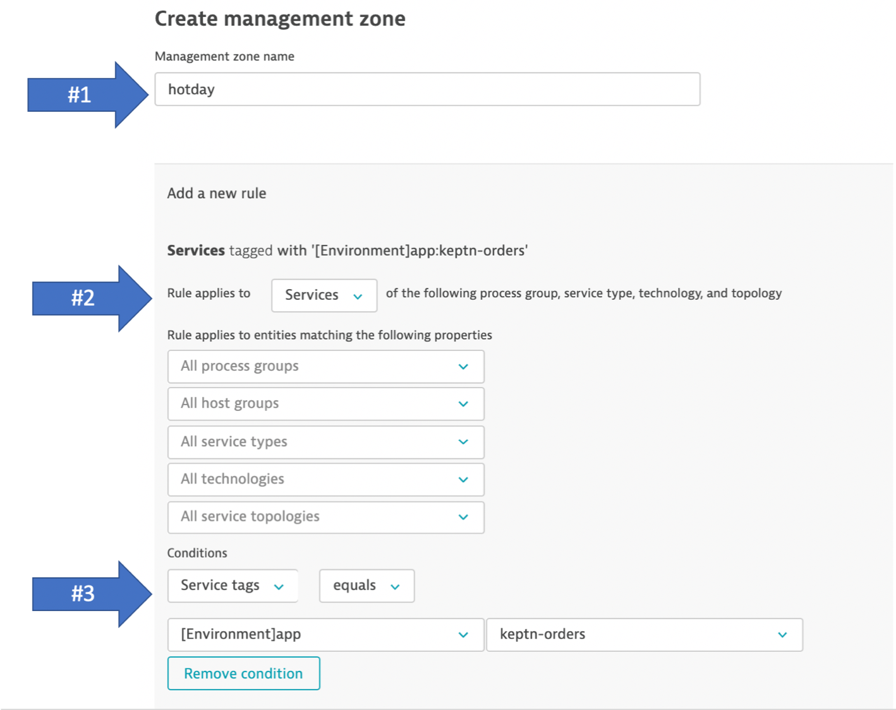

1. Select ```apply to underlying hosts of matching services``` check box.

1. Click the ```preview``` button to verify.

1. Save the zone. Click ```create rule``` button. Then ```Save changes``` button.

1. After navigating back on the ```transactions and services``` page, you can easy distinguish the services using the management zone filter

    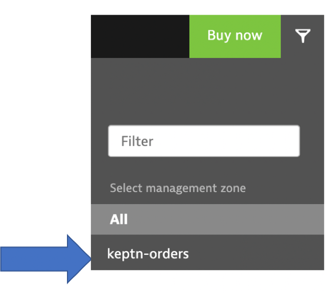

# Lab 1 Checklist

In this lab, you should have completed the following:
 
:white_check_mark: Installed the Dynatrace Agent using linux installation scripts 

:white_check_mark: How to add Tags by Environment Variables 

:white_check_mark: How to add Automatic Tagging rule 

:white_check_mark: How to add Management Zone and use it to filter services 

:white_check_mark: See how Dynatrace automatically monitors the application and where tags show up 

# References

[Dynatrace OneAgent](https://www.dynatrace.com/support/help/setup-and-configuration/dynatrace-oneagent/)

[Service Flow Analysis](https://www.dynatrace.com/support/help/how-to-use-dynatrace/transactions-and-services/analysis/service-flow/)

[Tags and MetaData](https://www.dynatrace.com/support/help/how-to-use-dynatrace/tags-and-metadata/)

[Tags based on Environment Variables](https://www.dynatrace.com/support/help/how-to-use-dynatrace/tags-and-metadata/setup/define-tags-based-on-environment-variables/)

[Management Zones](https://www.dynatrace.com/support/help/how-to-use-dynatrace/management-zones/)

<hr>

[Next Lab](../lab2) :arrow_forward: 
