# Lab 2 Overview

[Dynatrace and Load Testing Tools Integration](https://www.dynatrace.com/support/help/setup-and-configuration/integrations/third-party-integrations/test-automation-frameworks/dynatrace-and-load-testing-tools-integration/)

Learn how to use Dynatrace features that support Performance testing for each phase: scripting, analysis, and reporting.  We will use the same demo application from the previous lab and use a simple Unix shell script to automate load.

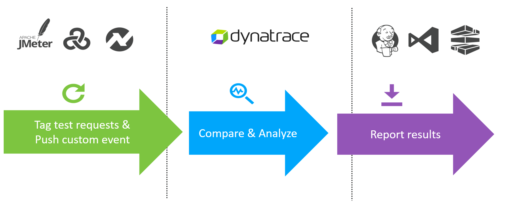

In this lab, you will:

1. [Tag Tests with HTTP headers](#Tag-Tests-with-HTTP-headers)
1. [Add Request Attributes rules](#Add-Request-Naming-rules)
1. [Add Request Naming rules](#Add-Request-Naming-rules)

## Tag Tests with HTTP headers

While executing a load test from your load testing tool of choice (JMeter, Neotys, LoadRunner, etc.) each simulated HTTP request can be tagged with additional HTTP headers that contain test-transaction information (for example, script name, test step name, and virtual user ID).

Dynatrace can analyze incoming HTTP headers and extract such contextual information from the header values and tag the captured requests with request attributes. Request attributes enable you to filter your monitoring data based on defined tags.

You can use any (or multiple) HTTP headers or HTTP parameters to pass context information. The extraction rules can be configured via ```Settings --> Server-side service monitoring --> Request attributes```.

The header ```x-dynatrace-test``` is used one or more key/value pairs for the header. Here are some examples:

| **Key**   | **Description**   |
| --- | --- |
| VU  | Virtual User ID of the unique user who sent the request.  |
| SI  | Source ID identifies the product that triggered the request (JMeter, LoadRunner, Neotys, or other)  |
| TSN  | Test Step Name is a logical test step within your load testing script (for example, Login or Add to cart.  |
| LSN  | Load Script Name - name of the load testing script. This groups a set of test steps that make up a multi-step transaction (for example, an online purchase).  |
| LTN  | The Load Test Name uniquely identifies a test execution (for example, 6h Load Test – June 25)  |
| PC  | Page Context provides information about the document that is loaded in the currently processed page.  |

## Exercise Steps

1. Review the simple shell script

    ```
    cd ~/workshop/lab2
    cat sendtraffic.sh
    ```

    Notice how each request adds in ```x-dynatrace-test``` header, using several keys/pairs such as Test Step Name (TSN) and Load Test Name (LTN)

    ```
    curl -s "$url/catalog/searchForm.html" -w "%{http_code}" -H "x-dynatrace-test: LSN=$loadScriptName;LTN=$loadTestName;TSN=$testStepName;" -o /dev/nul
    ```

1. In Dynatrace on the left menu, navigate to  ```settings --> server-side monitoring --> request attributes```

1. Click ```define a new request attribute``` button 

1. For the request attribute name use: ```TSN```

1. Leave other values the default. Click ```Add new data source``` button and configure as shown below.
  
    - Request attribute source = ```HTTP request header```
    - Specify where the attribute is captured and then stored = ```Capture on server side```
    - Parameter name = ```x-dynatrace-test```
    - Expand the ```Further restrict or process captured parameters (optional)``` section
    - fill in the ```Preprocess parameter by extracting substring value``` values with:
        - where = ```between```
        - string = ```TSN=```
        - ending = ```;```
    
        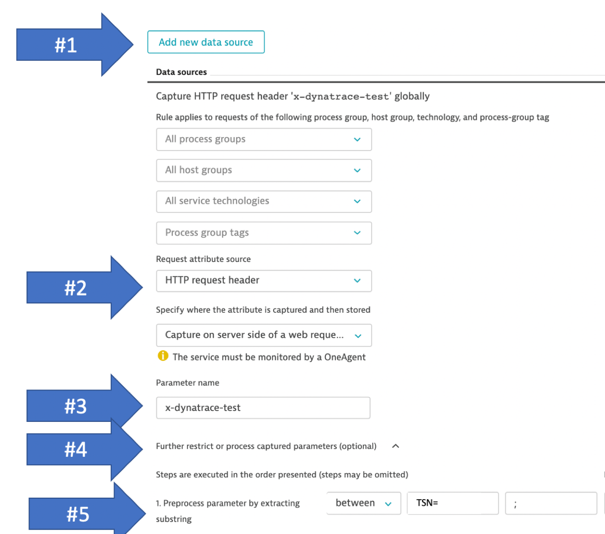

    - To verify, paste in this value and click the ```preview processed output``` button to verify.
        - ```x-dynatrace-test: LTN=myLoadTest;TSN=myTestStepName;```
    - It should look like this:

        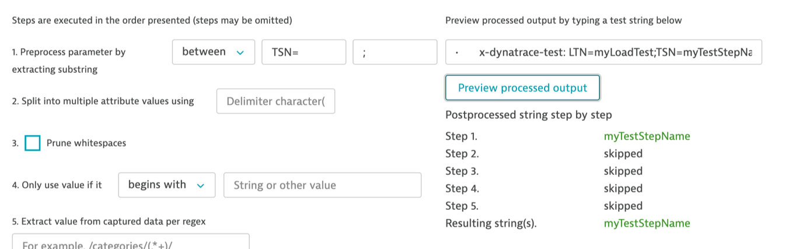

1. Save the data source request attribute rule

1. Save the request attribute rule

1. Now repeat the above steps to add a second request attribute for Load Test Name

    | **Request attributes Name**   | **Description**   | **Preprocessing parameter**   |
    | --- | --- | --- |
    | TSN  | Test Step Name  | TSN=  |
    | LTN  | Load Test Name  | LTN=  |

1. At the end you should see.

    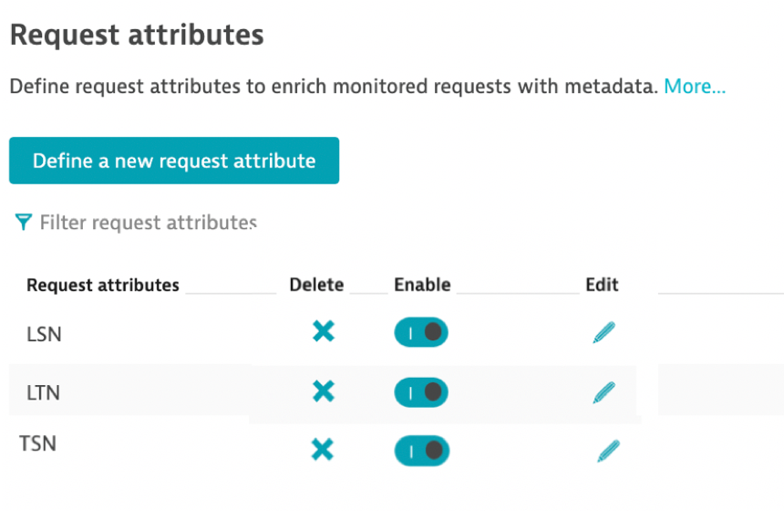

1. Run the send traffic script 

    ```
    cd ~/workshop/lab2
    ./sendtraffic.sh
    ```

    The output will show the calls along with the HTTP status code. You should see the HTTP 200 code for each call.

    ```
    Load Test Started. DURATION=6 URL=http://[Your IP] THINKTIME=5
    x-dynatrace-test: LSN=order_loadtest.sh;LTN=manual 2019-12-17_14:16:58;
    14:16:58
    calling TSN=CatalogSearchLanding; 200
    calling TSN=CatalogSearch; 200
    calling TSN=CatalogItemView; 200
    ...
    ```

1. Let's checkout Dynatrace and see what happened. First navigate to ```transactions and services``` and click on the ```catalog``` service. 

1. Within the ```catalog``` service, click on ```view dynamic requests``` 

    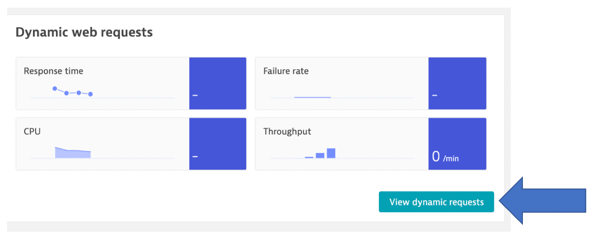

1. Now click on the ```request attributes``` button and review the requests with the ```Test Step Names (TSN)``` that are defined in the load test and match the rules we setup.

    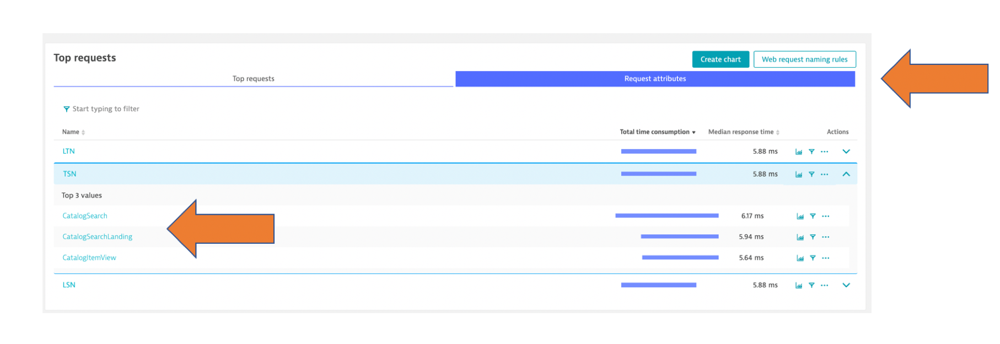

1. Click on one of the ```Step names``` and review the filtered chart results

## Add Request Naming rules

Within Dynatrace, you can use request naming rules to adjust how your requests are tracked and to define business transactions in your customer-facing workflow that are critical to the success of your digital business. With such end-to-end tracing, Dynatrace enables you to view and monitor important business transactions from end to end.

For the demo catalog service, each request URL to view a catalog item has the format ```##.html``` where the number is the product number, so we are going to define a naming rule so that all of these requests are just called ```product detail```.

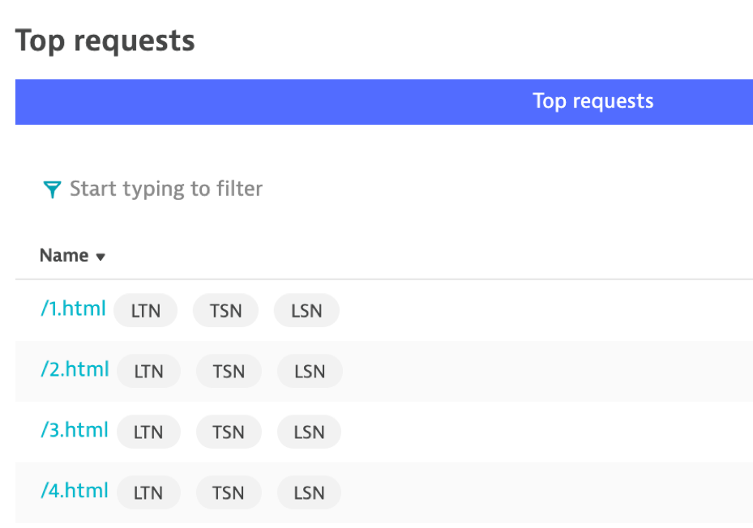

## Exercise Steps

1. To add a naming rule, click on the ```web request naming rule``` button

    

    NOTE: You can also get to the rules at the top of the services page and choosing the edit option as shown below.

    

1. Within in the service settings, navigate to Web request naming and click the ```Add rule``` button 

    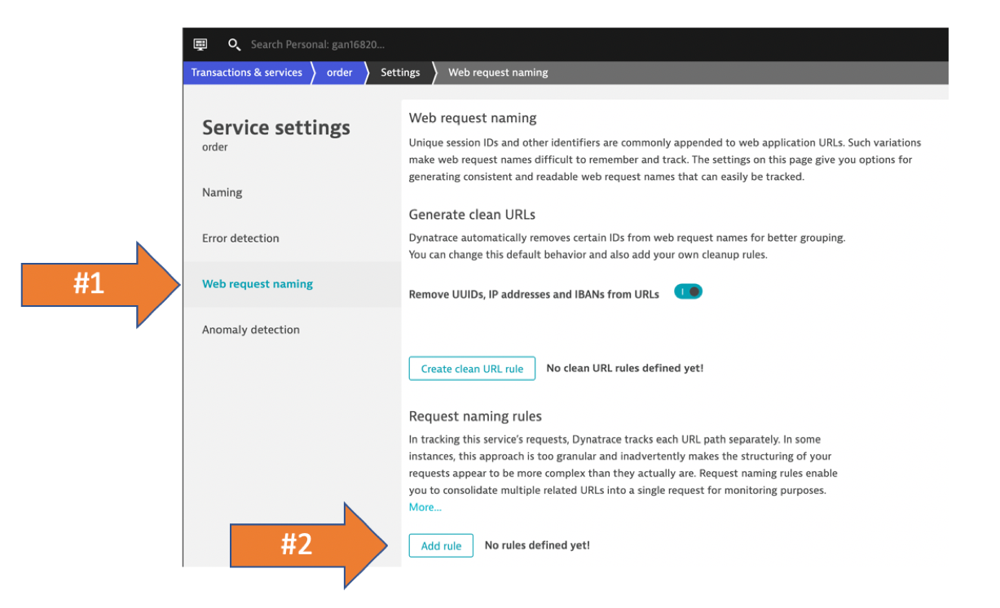

1. Configure the rule:

    - naming pattern = ```Item Detail```
    - conditions = ```URL Path```
    - URL path = ```contains regex``` with the value ```/\d+.html```
    - click the ```preview rule``` button to verify.
    - It should look like this:

    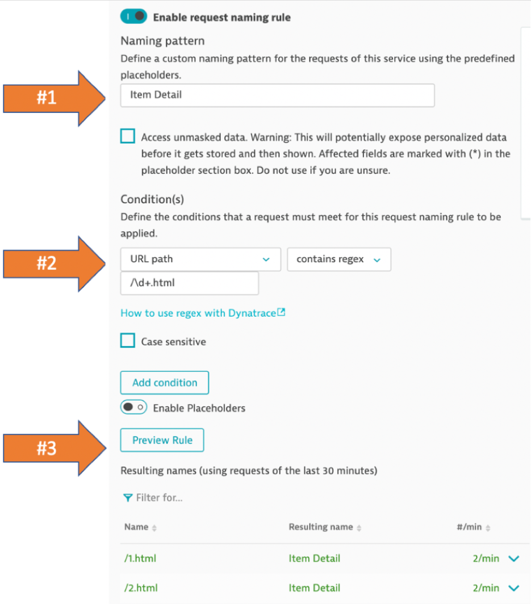

1. Save the rule

1. The change will not update past requests, so we need to load script again so that the rule gets applied

    ```
    ./sendtraffic.sh
    ```

1. Now we can navigate back the "catalog" service and click the view dynamic requests

    

1. Review the change. You may still see the old requests without the new name.

    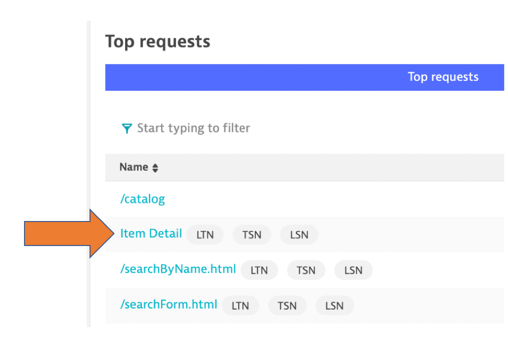

    Click on the name to filter it with the time-series chart.

    By using request attributes in combination with naming rules, you can capture even more context around your requests and use this additional detail to slice and dice your monitoring data.

1. Now we can use filters in Dynatrace to examine data.

   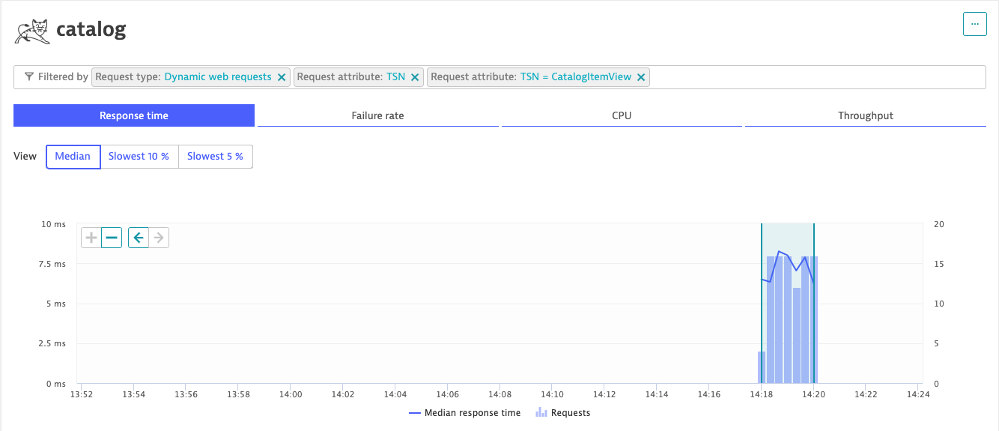

# Lab 2 Checklist

In this lab, you should have completed the following:

:white_check_mark: How to add x-dynatrace-test HTTP headers and see how they can be combined with Request Attributes rules

:white_check_mark: How to use Request Attributes rules during analysis

:white_check_mark: How to add Request Naming rules and see how they help during analysis

# References

[Dynatrace and Load Testing Tools Integration](https://www.dynatrace.com/support/help/setup-and-configuration/integrations/third-party-integrations/test-automation-frameworks/dynatrace-and-load-testing-tools-integration/)

<hr>

:arrow_backward: [Previous Lab](../lab1) | [Next Lab](../lab3) :arrow_forward: 
