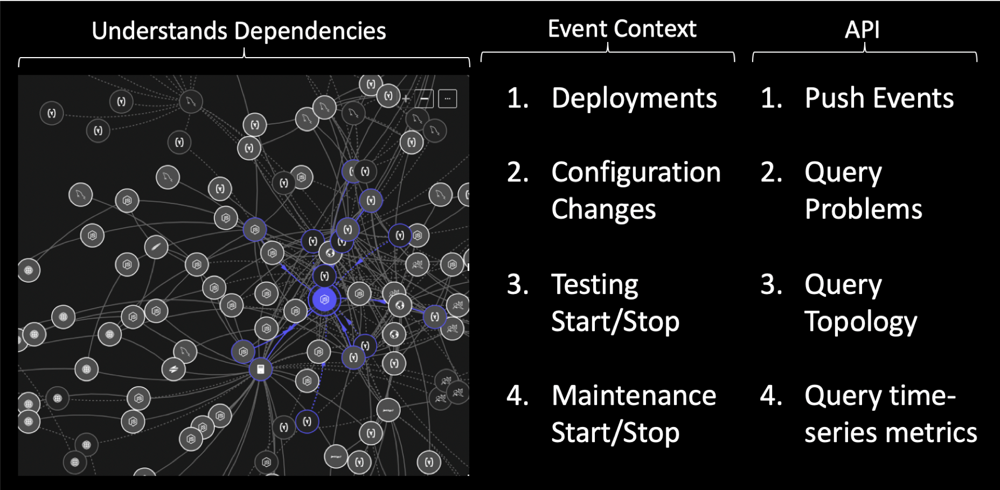
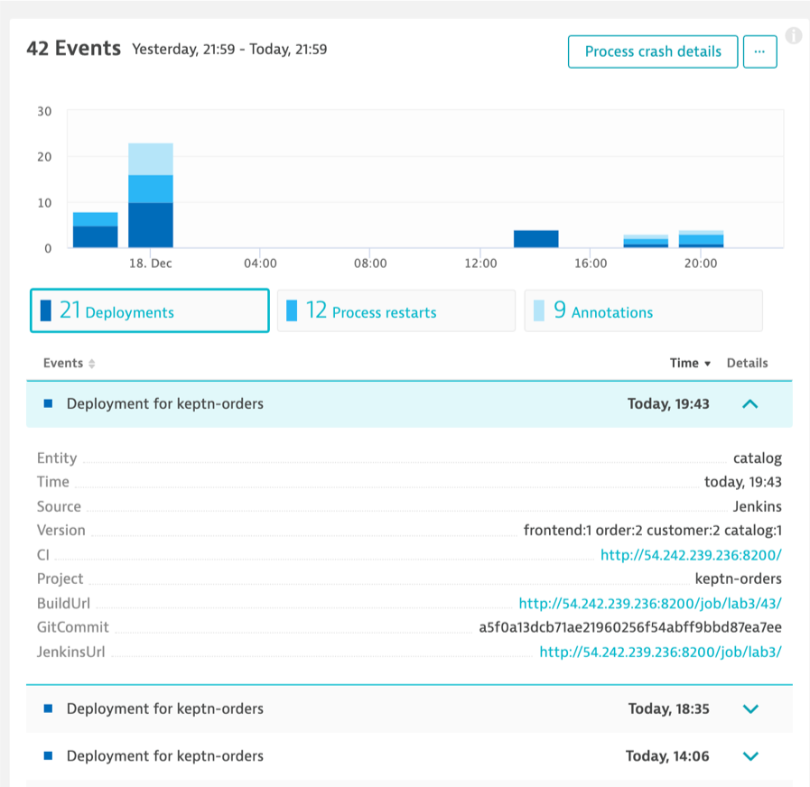
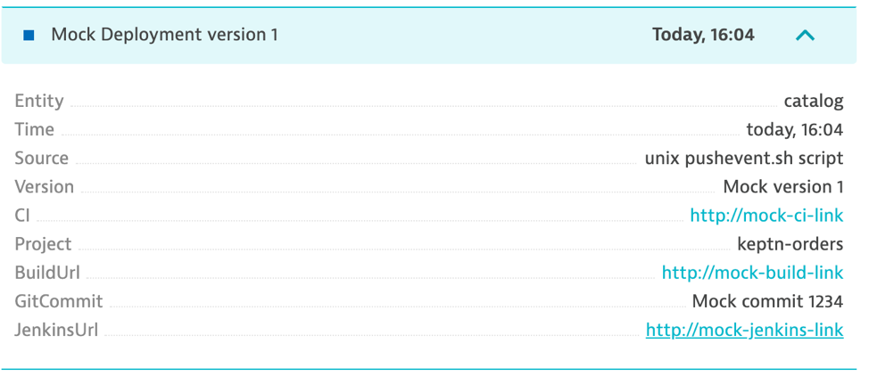
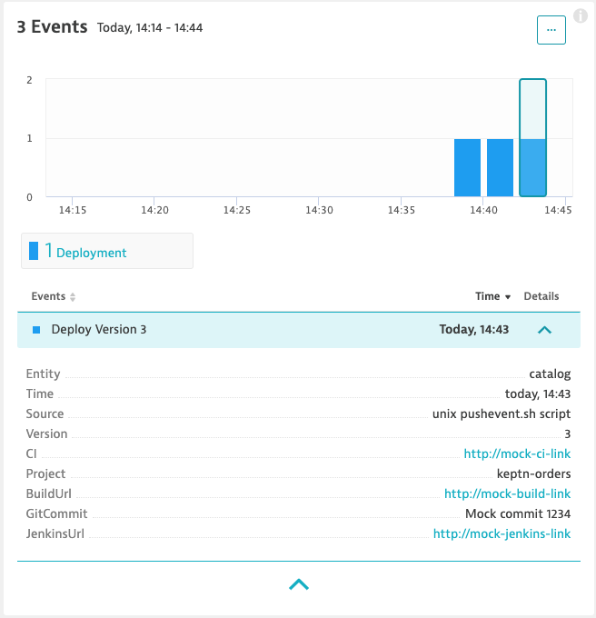
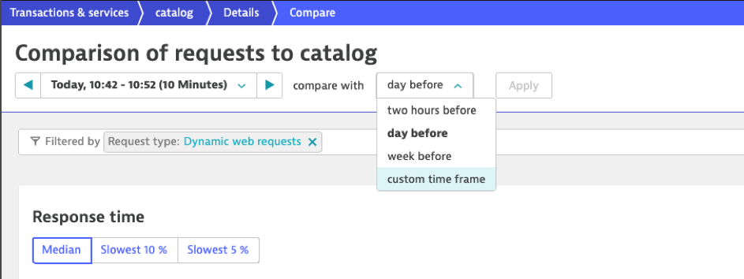
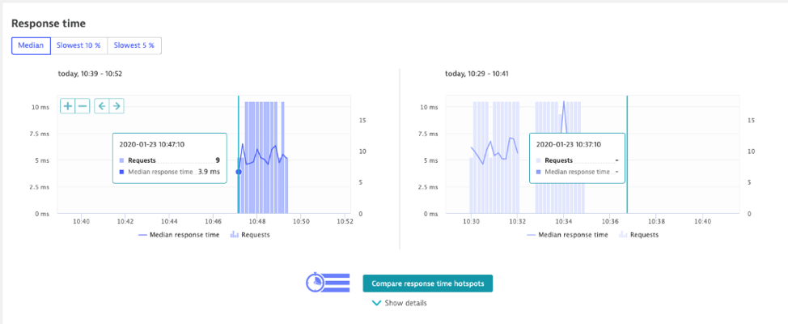
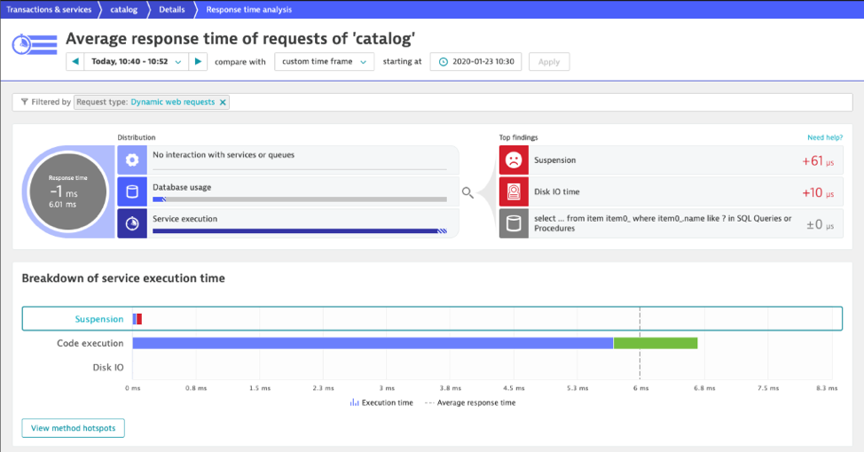
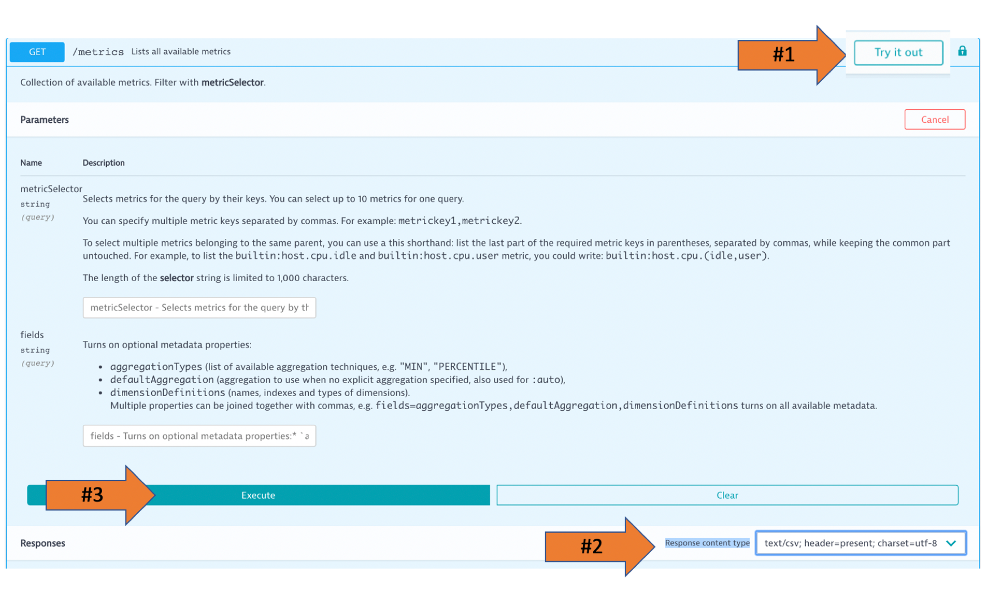
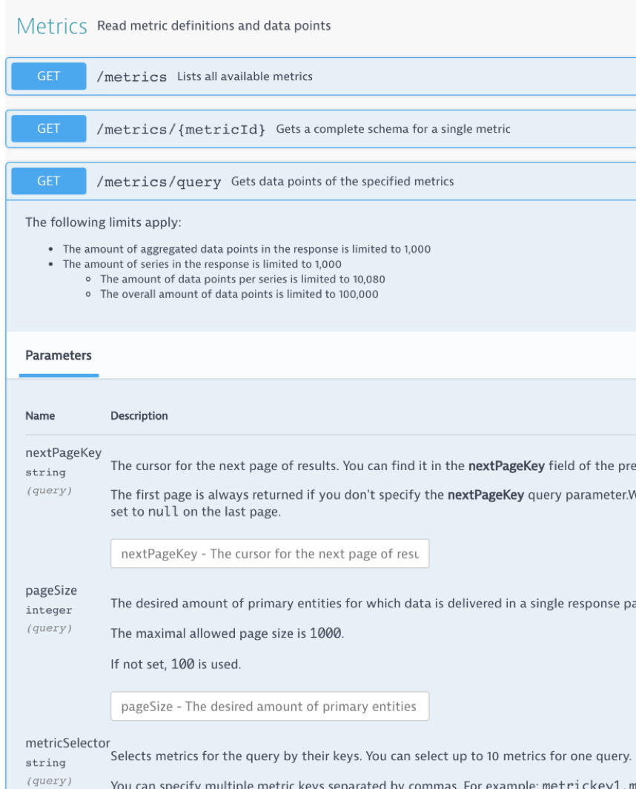

# Lab 3 Overview

In the previous lab we learned how to setup Dynatrace tags.  These tags are how we can use to push event context and query the Dynatrace collected data in the web UI. Now we will make use of these same tags using the Dynatrace API.



In this lab, you will:

1. [Add Dynatrace API Token](#Add-Dynatrace-API-Token)
1. [Save API Token for the lab](#Save-API-Token-for-the-lab)
1. [Call Events API](#Call-Events-API)
1. [Call Metrics v2 API](#Call-Metrics-v2-API)
1. [Automate scoring with the Metrics v2 API](#Automate-scoring-with-the-Metrics-v2-API)

## Add Dynatrace API Token

[Dynatrace API - Authentication](https://www.dynatrace.com/support/help/extend-dynatrace/dynatrace-api/basics/dynatrace-api-authentication/)

Dynatrace has a large set of APIs to manage the Dynatrace configuration such as tag, alert, maintenance windows and the environment such as retrieving timeseries and topology metrics, managing problems and events.

We need to secure a Dynatrace API token for access to the Dynatrace REST-based API. All API calls pass this token in the request header as in this example sample:

```
curl --request GET \
  --url https://[YOUR TENANT].sprint.dynatracelabs.com/api/v1/event \
  --header 'Authorization: Api-Token [YOUR API TOKEN]'
```

## Exercise Steps

1. To add a new API token, in Dynatrace in the left menu navigate to ```settings --> integration --> Dynatrace API```

1. Click the ```generate token``` button and enter the name ```hotday``` and enable the permissions as shown below.

    

## Save API Token for the lab

Some of the lab provide scripts require the Dynatrace URL and API.  To save you from providing these time, we have a script that will prompt and save these to JSON file that will be read automatically.

1. Run the script to provide your values

    ```
    cd ~/scripts
    sudo ./enter-script-inputs.sh
    ```

1. Enter in your Dynatrace tenant, Dynatrace API token, and Neoload API Token and choose to save.  Here is what it should look like.

    ```
    ===================================================================
    Please enter script input values
    ===================================================================
    Dynatrace Tenant: XXX of XXX.sprint.dynatracelabs.com
    Dynatrace API Token
    NeoLoad Web API Key
    ===================================================================
    Please confirm all are correct:
    ...
    ```

## Call Events API

We are going to review how to use the events API to push information-only events to the monitored entities in our tests. There are several event types, and here is how a ```CUSTOM_DEPLOYMENT``` looks like in Dynatrace.




## Exercise Steps

1. Review the push event script and notice the ```tagRule```. This script will send a ```CUSTOM_DEPLOYMENT``` event to all the services with the ENVIRONMENT tag ``` app:keptn-orders```.

    ```
    cd ~/workshop/lab3
    cat pushevent.sh
    ```

1. Run the push event script with argument of mock deployment version #1

    ```
    ./pushevent.sh 1
    ```

    You should see output like this. NOTE: Those numbers at the end map to the matching Dynatrace entity IDs.

    ```
    Pushing event to: https://[YOUR TENANT].sprint.dynatracelabs.com/api/v1/events
    {"storedEventIds":[-6767884103997654659,-8278467612792737421,
    ...
    ...
    ,"3582171445072147045_1576
    726279528","8471371692288947486_1576726279528"],"storedCorrelationIds":[]}
    ```

1. Review the new event in Dynatrace, by navigating to any of the services. The event table should look like this.

    

    The benefit of events is that it provides immediate context and links back to tools and teams responsible for changes in the environment.

1. Lets run a few more simulated tests and deployment events

    ```
    cd ~/workshop/lab3
    ./pushevent.sh 2
    ./sendtraffic.sh

    ./pushevent.sh 3
    ./sendtraffic.sh
    ```

1. Now try the comparison between builds.  Navigate back to the "transactions and services" menu and choose the "catalog service"  Notice how you have multiple deployments events.

   

1. Now choose the ```view dynamic requests``` button to few a set of activity.  You can hover or click the small grey dot in the time line to view the event that was pushed.

    

1. Now we can do comparisons between deployments and load testing events. Under the requests graph, choose the ```view response time hot spots``` button

1. We will need to adjust the timeframes for the analysis.

    

    We will use the time picker to select a ```custom time frame```.  We can also use the time shifting options is the graphs.

    Once we have two time frames selected with transactions, we can compare the results.

    

    Now select ```Compare response time hotspots```.

    This allows us to analyze the ```Top findings``` and ```view method hotspots```

    

## Call Metrics v2 API

[Dynatrace API](https://www.dynatrace.com/support/help/extend-dynatrace/dynatrace-api/environment-api/)

Many use cases within your software development and delivery pipelines depend on the real-time metrics that your Dynatrace environment collects. One example is the automatic check of monthly load-test results for performance reporting based on Dynatrace synthetic tests.

The Dynatrace REST API endpoint /api/v1/timeseries has long enabled API consumers to ingest individual metrics for the implementation of external use-cases. In the summer of 2019, an updated of metrics API endpoint /api/v2/metrics/series based on an improved metrics framework now provides:

- A logical tree structure for all available metric types
- Globally unique metric keys that better integrate over multiple Dynatrace environments
- Flexibility to extend Dynatrace and better fit it to your specific business cases

Let's just show how to call it. Later, you can read more in this blog and the Dynatrace docs

## Exercise Steps

1. In Dynatrace, navigate to the environment API page from the top right ```person``` icon

    

1. On the API web page, pick the ```environment v2``` API from the drop down

    

1. Pick the 'Authorize' button, scroll to find the ```DataExport section```, paste in your API Token, and pick 'Authorize' button

    

1. Let's first review the metrics available using the ```GET Metrics``` endpoint. This endpoint lists all metric definitions, with the parameters of each metric.

    - click the Try it button
    - Below the ```Clear``` button, pick the Response content type of ```text/csv```
    - click the Execute button

    

1. Let's now try pulling back some metrics.

    - Expand the ```GET /metrics/query``` section.

    

    - Fill in these values to get the REQUEST COUNT for the orders service and click the 'Execute' button

    | **Parameters**   | **Value**   |
    | --- | --- |
    | selector  | builtin:service.requestCount.server  |
    | resolution  | 10m  |
    | from  | now-2h  |
    | scope  | type(SERVICE), tag(service:order),tag([ENVIRONMENT]app:keptn-orders)  |

1. The results will look something like this. Note the entity ID that is Dynatrace's internal ID for this service.

    

1. Adjust the "Resolution" field to the value of "Inf" and re-run

1. Experiment with other metrics by adjusting the "selector" value

    - builtin:service.response.time:percentile(95)
    - builtin:service.requestCount.server
    - builtin:service.response.time:avg

## Automate scoring with the Metrics v2 API

Now run a provided lab script that calls the metrics API and evaluates the results against target service levels.

```
cd ~/workshop/helper-scripts/scripts
./validate-service-levels.sh
```

There is verbose output that shows the call to the API and the JSON results.  Built into the script are targets the results are evaluated against.   Feel free to review the script too.

## Stop the sample application

Stop the running application so that we can run the next lab

```
cd ~/helper-scripts
./forcestop.sh
```

Verify that no containers are running

# Lab 3 Checklist

In this lab, you should have completed the following:

:white_check_mark: How to create a Dynatrace API Token

:white_check_mark: Learn the various Dynatrace Events and how to create an event using the API

:white_check_mark: Basic comparison feature in Dynatrace

:white_check_mark: How to access the API Web UI interface

:white_check_mark: Learn about the Metrics v2 API and how to query metrics using the API

:white_check_mark: Sample app is stopped

<hr>

:arrow_backward: [Previous Lab](../lab2) | [Next Lab](../lab4) :arrow_forward: 
