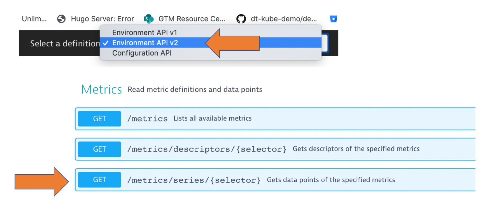
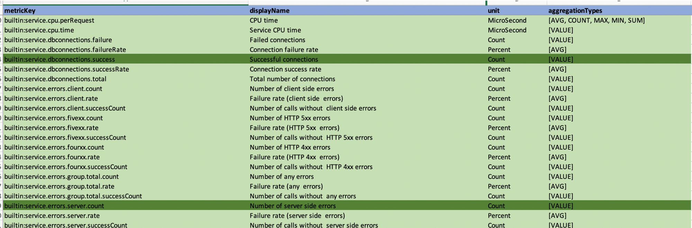
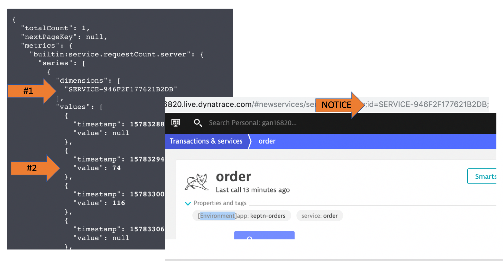

# Lab 2 Overview

In this lab, learn how to use Dynatrace features that support Performance testing for each phase: scripting, analysis, and reporting.


We will use the same demo application from the previous lab and use a simple unix shell script to automate load.  

# Exercises

1. [Add Dynatrace API Token](#Add-Dynatrace-API-Token)
1. [Call Events API](#Call-Events-API)
1. [Call Metrics v2 API](#Call-Metrics-v2-API)
1. [Stop the sample application](#Stop-the-sample-application)

## Add Dynatrace API Token

Dynatrace has a large set of APIs to manage the Dynatrace configuration such as tag, alert, maintainence windows and the environment such as retrieving timeseries and topology metrics, managing problems and events.

We need to a secure Dynatrace API token for access to the Dynatrace REST-based API.  All API calls pass this token in the request header as in this code sample:

```
curl --request GET \
  --url https://[YOUR TENANT].live.dynatrace.com/api/v1/event \
  --header 'Authorization: Api-Token [YOUR API TOKEN]' 
```

### Exercise Steps

1. To add a new API token, in Dynatrace in the left menu navigate to ```settings --> integration --> Dynatrace API```

1. Click the ```generate token``` button and enter the name ```hotday``` and enable the ```read & write configation``` settings as shown below.

    

1. Save both your Dynatrace URL your token to your cheatsheet file on your laptop. You will need this now and for the other labs.

    ```
    Dyntrace URL: https://[YOUR TENANT].live.dynatrace.com 
    Dyntrace Token: [YOUR DYNATRACE API TOKEN]
    ```

## Call Events API

We are going to review how to use the [events API](https://www.dynatrace.com/support/help/extend-dynatrace/dynatrace-api/environment-api/events/post-event/) to push information-only events to the monitored entities in our tests.  There are serveral types, but will cover the CUSTOM_DEPLOYMENT and CUSTOM_ANNOTATION types.

Here is how a CUSTOM_DEPLOYMENT looks like in Dynatrace. The benefit is that it provides immediate context and links back to tools and teams responsible for changes in the environment.  


Each event type takes parameters as shown in the table below.


### Exercise Steps

1. Review the push event script and notice the ```tagRule```. This script will send a CUSTOM_DEPLOYMENT event to all the services with the ENVIRONMENT tag ```app:keptn-orders```.

    ```
    cd ~/hotday/lab3
    cat pushevent.sh
    ```

1. Run the push event script and provide your Dynatrace tenant and API token as parameters 

    ```
    cd ~/hotday/lab3
    ./pushevent.sh https://[YOUR TENANT].live.dynatrace.com [YOUR DYNATRACE API TOKEN]
    ```

    You should see output like this.  NOTE: Those numbers at the end map the to matching Dynatrace entity IDs.

        ```
        Pushing event to: https://[YOUR TENANT].live.dynatrace.com/api/v1/events

        {"storedEventIds":[-6767884103997654659,-8278467612792737421,
        ...
        ...
        ,"3582171445072147045_1576
        726279528","8471371692288947486_1576726279528"],"storedCorrelationIds":[]}
        ```

1. Review event in Dynatrace, by navigating to any of the services.  The event table should look like this.

    

## Call Metrics v2 API

Many use cases within your software development and delivery pipelines depend on the real-time metrics that your Dynatrace environment collects. One example is the automatic check of monthly load-test results for performance reporting based on Dynatrace synthetic tests.

The Dynatrace REST API endpoint ```/api/v1/timeseries``` has long enabled API consumers to ingest individual metrics for the implementation of external use-cases. In the summer of 2019, an updated of metrics API endpoint ```/api/v2/metrics/series``` based on an improved metrics framework now provides:
* A logical tree structure for all available metric types
* Globally unique metric keys that better integrate over multiple Dynatrace environments
* Flexibility to extend Dynatrace and better fit it to your specific business cases

Lets just show how to call it and can later read more in this [blog](https://www.dynatrace.com/news/blog/integrate-dynatrace-more-easily-using-the-new-metrics-rest-api/) and the [Dynatrace docs](https://www.dynatrace.com/support/help/extend-dynatrace/dynatrace-api/environment-api/metric-v2/)

### Exercise Steps

1. In Dynatrace, navigate to the environment API page from the top right "person" icon

    

1. On the API web page, pick the 'environment v2' API from the drop down 

    

1. Pick the 'Authorize' button, scroll to find the 'DataExport section', paste in your API Token, and pick 'Authorize' button

    

1. Lets first review the metrics available using the 'GET Metrics' endpoint.  This endpoint lists all metric definitions, with the parameters of each metric. 

    * click the ```Try it``` button
    * Below the 'ClearJust pick the Response content type of ```tex/csv``` 
    * click the ```Execute``` button

    

    I have saved the output to Excel and sorted it. Here are some of the service metrics available.

    

1. Lets now try pulling back some metrics. 

    * Expand the 'GET /metrics/series/{selector}' section.
    * Fill in these values as to get the REQUEST COUNT for the orders service and click the 'Execute' button

    | Parameters | Value |
    |---|---|
    | selector | builtin:service.requestCount.server |
    | resolution | 10m |
    | from | now-2h |
    | scope | tag(service:order),tag([Environment]app:keptn-orders) |

    The results will look like this.  Note the entity ID that is Dynatrace's internal ID for this service.

    

    Experiment with other metrics and times:
    * builtin:service.requestCount.server
    * builtin:service.response.time:avg
    * builtin:service.response.time:percentile(90)

## Stop the sample application

1. Stop the running application so that we can run the next lab

    ```
    # stop up the application
    cd ~/hotday/lab2
    sudo docker-downcompose down
    ```

:arrow_backward: [Previous Lab](../lab2) | [Next Lab](../lab4) :arrow_forward: 