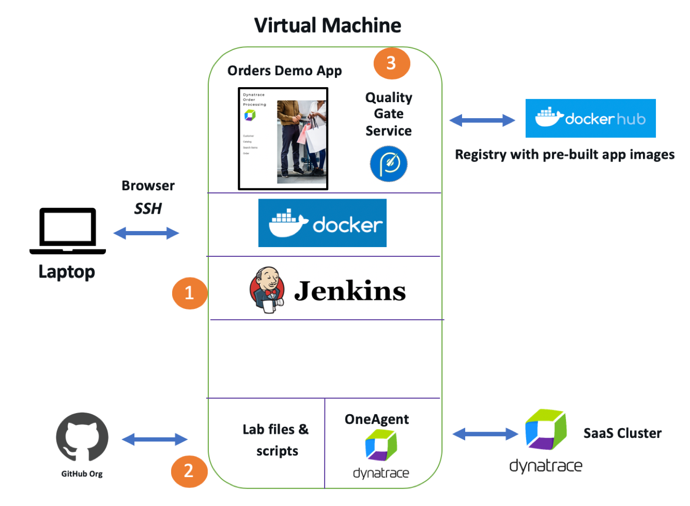
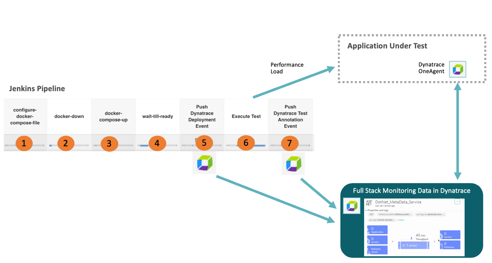
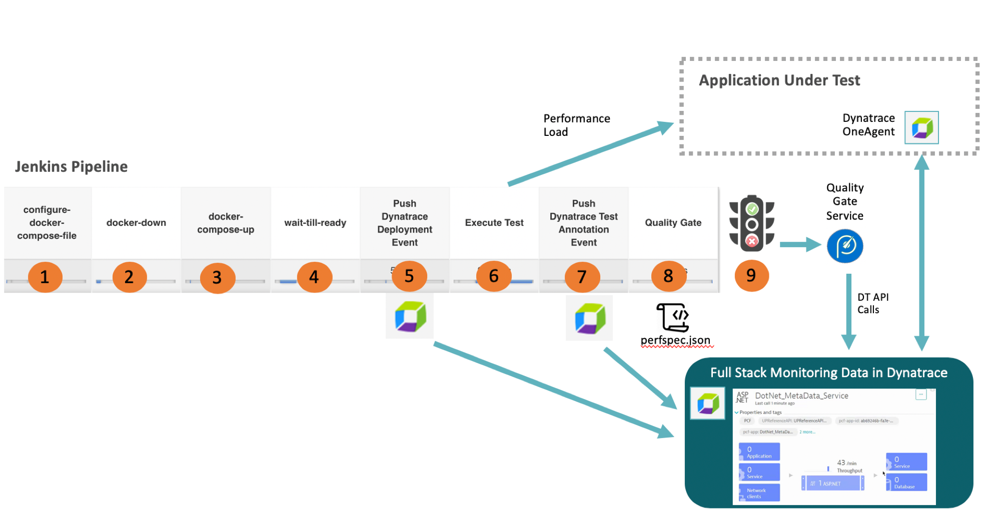

# Lab 3

In this lab, learn how to run automated performance tests within a pipeline and add in 
automated quality gates that ensure Service Level Objectives (SLO) using Service Level Indicators (SLI).

The picture below shows what we will complete in this lab.



Referring to the diagram above, learn how to:
1. Review Jenkins setup
2. Review and run pipeline files and scripts
3. Quality Gate web service running as a Docker container

# Exercises

1. [Configure and review Jenkins server](#Configure-and-review-Jenkins-server)
1. [Run the pipeline](#Run-the-pipeline)
1. [Dashboard and Charts](#Dashboard-and-Charts)
1. [Add Quality Gate](#Add-Quality-Gate)
1. [Run the pipeline with Quality Gate](#Run-the-pipeline-with-Quality-Gate)

## Configure and review Jenkins server

We have installed Jenkins on the VM, but you need to complete the setup of it before we can use it.

1. Run this command to get your URL.  Save it to your cheatsheet.

    ```
    echo "http://$(curl -s http://checkip.amazonaws.com):8080"
    ```

1. Navigate to the URL, and login to jenkins with the credentials provided.

1. Goto 'manage jenkins --> Configure System' menu

1. Navigate to the 'Global properties' section and adjust these values

    * DT_URL = https://[YOUR TENANT].live.dynatrace.com
    * DT_TOKEN = [YOUR DYNATRACE API TOKEN]

1. Click the ```Save``` button on the bottom of the page.

## Review Jenkinsfiles

Here is a diagram of the pipeline steps and interactions with Dynatrace.



1. Review Jenkinsfiles

    ```
    cd ~/hotday/lab4
    cat Jenkinsfile
    ```

1. Run the pipeline and review console log as it runs. This will deploy app, execute tests, push events

    

## Dashboard and Charts

Here we will review the automated Dynatrace events, the autoamated transaction naming and ways to review the results.

Run another test for a problem build.

## Add Quality Gate

Automated performance quality gates aim to eliminate the reliance on manual performance and architecture quality reviews following a deployment. Using a “Performance Specification” (PerfSpec) file, which defines performance and architecture metrics to query during pipeline execution, allows the collection and evaluation to be automated. Having such a PerfSpec file that is version controlled next to your source code follows the “everything-as-code” and GitOps approach

In this lab, we will use a [Microservice web application](https://github.com/dt-demos/pitometer-web-service) that provides the processing logic of a passed in "perfspec" and start/end time frame. This service can be used as a software quality gate within our Jenkins pipelines.

This web service runs as a Docker container listening on port 9080.

### Request 

POST request to https://[baseurl]:8090/api/pitometer
JSON Body Structure
* timeStart - start time in UTC unix seconds format used for the query
* timeEnd - end time in UTC unix seconds format used for the query
* perfSpec - a JSON structure containing the performance signature
* spec_version - string property with pitometer version. Use 1.0
* indicator - array of each indicator objects
* objectives - object with pass and warning properties

### Response
A valid response will return an HTTP 200 with a JSON body containing these properties:
* totalScore - numeric property with the sum of the passsing indicator metricScores
* objectives - object with pass and warning properties passed in from the request
* indicatorResults - array of each indicator and their specific scores and values
* result - string property with value of 'pass', 'warn' or 'warning'

### Exercise Steps

1. review the perfspec file we will use

    ```
    cd ~/hotday/lab4/scripts
    cat perfspec.json
    ```

1. start the quality gate service

    ```
    # adjust this value
    export DT_BASEURL=https://[YOUR TENANT].live.dynatrace.com

     # adjust this value
    export DT_TOKEN=[YOUR DYNATRACE API TOKEN]

    # run this full command
    sudo docker run -p 8090:8080 -d \
        -e DYNATRACE_BASEURL=$DT_BASEURL \
        -e DYNATRACE_APITOKEN=$DT_TOKEN \
        dtdemos/pitometer-web-service

    # verify container is running
    sudo docker ps -f "ancestor=dtdemos/pitometer-web-service"
    ```

1. review the quality gate script

    ```
    cat qualitygate.sh
    ```

1. run the quality gate script and review the output

    ```
    ./qualitygate.sh
    ```

## Run the pipeline with Quality Gate

Here is a diagram of the additonal quality gate pipeline step and interactions with Dynatrace.



1. Review Jenkinsfile with the quality gate step added.

    ```
    cd ~/hotday/lab4
    cat Jenkinsfile.withgate
    ```

1. Run the pipeline and review console log as it runs. This will deploy app, execute tests, push events

1. Run another test for a problem build.

:arrow_backward: [Previous Lab](../lab3) | [Next Lab](../lab5) :arrow_forward: 