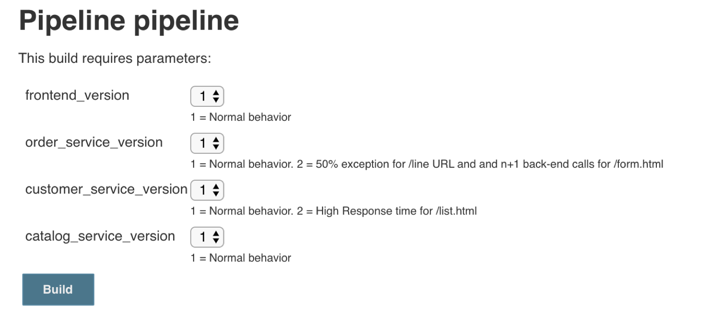
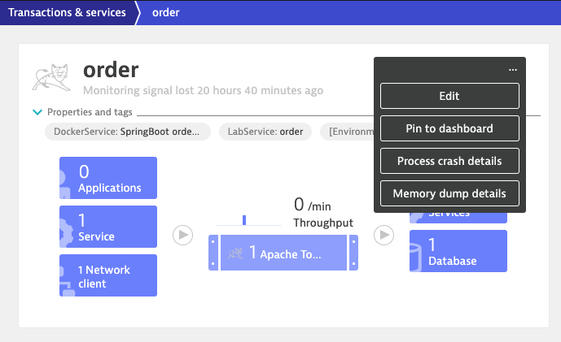
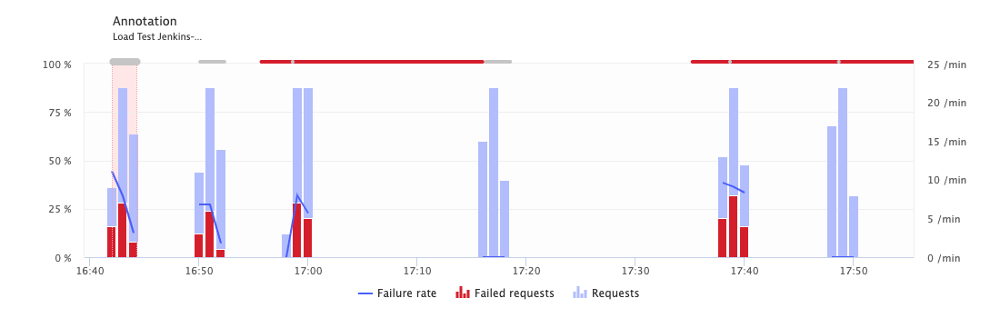
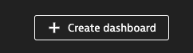
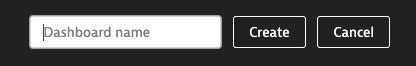
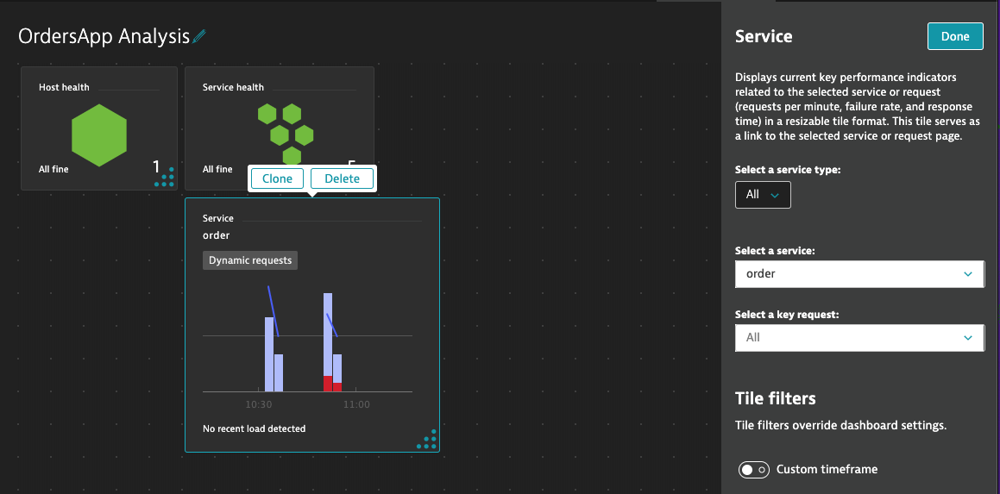
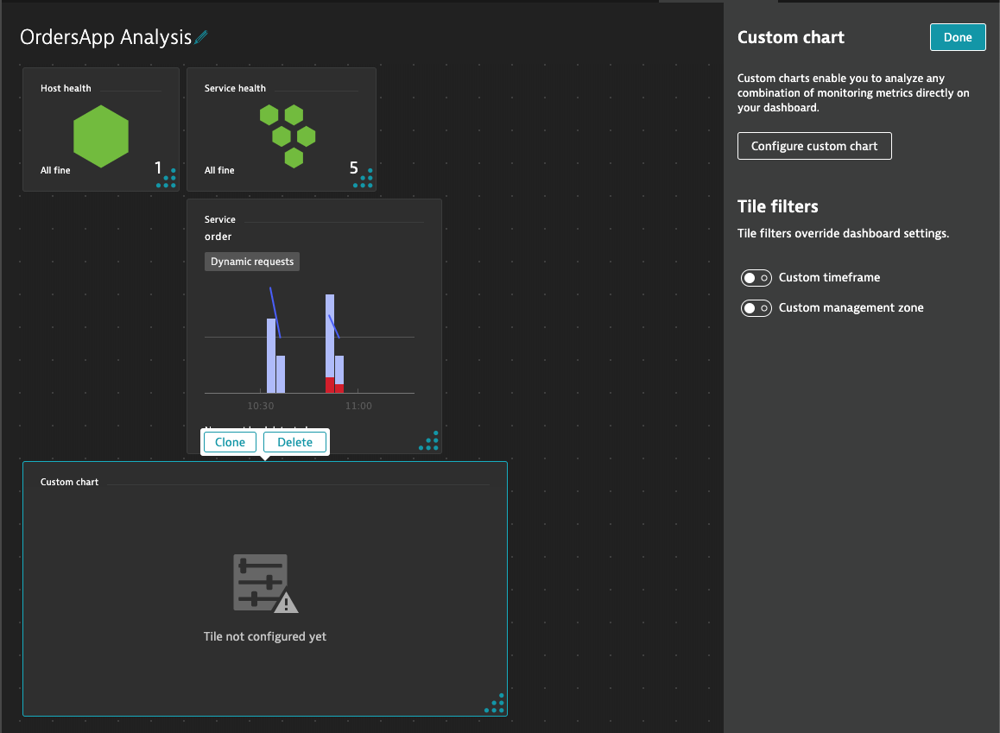
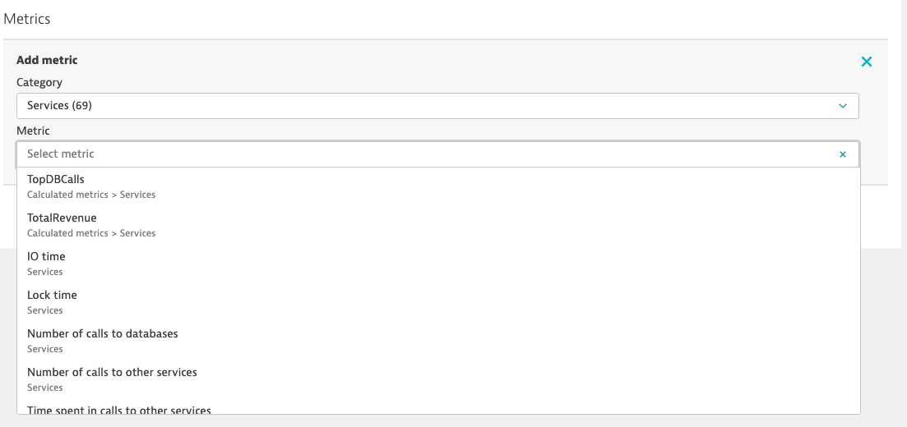
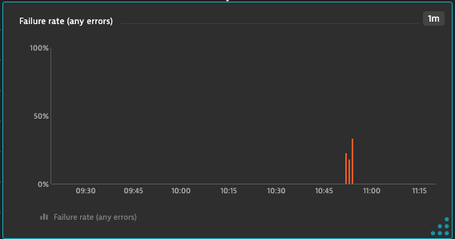

# Lab 4 Overview

Learn how to run automated performance tests within a pipeline and add in a step that validates a Service Level automatically.

In this lab, you will:

1. [Jenkins server setup](#Jenkins-server-setup)
1. [Run the pipeline](#Run-the-pipeline)
1. [Run the pipeline with Service Level Validation](#Run-the-pipeline-with-Service-Level-Validation)
1. [Dashboard and Charts](#Dashboard-and-Charts)
1. [Triage performance issues](#Triage-performance-issues)

The picture below shows what we will complete in this lab.


## Jenkins server setup

The lab has a script that will install Jenkins and configure it with the plugin, jobs, and global variables that the jobs expect. To install Jenkins, just run these commands.

```
cd ~/scripts
sudo ./deploy-jenkins.sh
```

This process will take about 2 minutes and at the end it will display the URL to Jenkins

```
=========================================
Running start-jenkins.sh...
Ready!!
=========================================

Jenkins Server
http://x.x.x.x:8080
```

Now open Jenkins in a browser and login with the credentials provided


## Run the pipeline

The pipeline we have provided will deploy the application, execute tests, and push Dynatrace deployment and test events. Here is a diagram of the pipeline steps and interactions with Dynatrace.


1. Navigate to the ```lab3``` section and click on the "pipeline" task

    

1. Choose the "build with parameters" and click the "build" button to run the pipeline as shown below and then review console log as it runs.

    

1. Now go back to the "transaction and services" within Dynatrace and choose the order service.  Review newly created events.

1. For the same order service, click on the "view Dynamic requests" and see how the request attributes for the Load Test Name (LTN) was filled in

1. Re-Run the pipeline with the order service version "2" and review console log as it runs.

1. While the job is running, lets review the Jenkinsfile to see the details for the pipeline.

    ```
    cd ~/workshop/lab4
    cat Jenkinsfile
    ```

## Run the pipeline with Service Level Validation

Here is a diagram of the additional validation step and interactions with Dynatrace.


1. The Jenkinsfile will call the validate-service-levels.sh that we manually ran in the previous lab.

    ```
    cd ~/workshop/lab4
    cat Jenkinsfile.withgate
    ```

1. Run the pipeline and review console log as it runs. This will deploy app, execute tests, and push events.  This time notice, new service level parameters.

    

1. Re-Run the pipeline with the order service version "2" and review console log as it runs.   To see how the automated validation stopped the build.

## Dashboards, Charts and Problems

  [Problem Detection and Analysis](https://www.dynatrace.com/support/help/how-to-use-dynatrace/problem-detection-and-analysis/)
  
  [Root Cause Analysis](https://www.dynatrace.com/support/help/how-to-use-dynatrace/problem-detection-and-analysis/problem-analysis/root-cause-analysis/)
  
  [Dashboards and Charts](https://www.dynatrace.com/support/help/how-to-use-dynatrace/dashboards-and-charts/)

1. First we can examine the error rates. Navigate to ```transactions and services``` then select the ```order``` service, then select the ```View dynamic request``` then the ```Falure Rate``` tab.

   
 
1. Now let's adjust the anomaly detection for the order service. Navigate back to the ```order``` service by selcting the ```order``` from the breadcrumb. 

1. Now select ```Edit``` after clicking the ellipsis.

   

1. Set the following values for the ```Anomaly Detection```

   
  
1.  We will need to change these settings
    * Turn off ```"global settings"```
    * change ```"Detect increase failure rate" to use "fixed thresholds"```
    * change ```"Alert"``` to use 3%

1. Run another pipline build with the order service version "2".

   After a few moments, we should see a problem card in Dynatrace.

      

   Now we can also dive into the Problem details.

   

## Triage performance issues

1. Now we can continue and use Dynatrace to analyze the errors.

    Use the problem card to drill down into the details, then we will click on the errors on the service.

   

1. We can then examine the Failure Rates over time,

   

1. From here click on the ```"Analyze failure rate degradation"```, then we will see the error details.

     
   
1. finally run one more build with the order service version "1"

    This will return the failure rate to zero and close the problem.
    
    

## Dashboards

[Create Dashboard](https://www.dynatrace.com/support/help/how-to-use-dynatrace/dashboards-and-charts/dashboards/create-dashboards/)

First we need to create a Dashbaord with a few tiles.

1. Choose ```"Dahboards"``` from the menu.

1. Then select ```"create dashboard"```
    
1. Give the Dashbaord a name and click ```"Create"```
    
1. Now we can add widgets to the dashboard.
    

Dynatrace makes it easy to create your own fully customizable dashboards. You can easily create, modify, delete, and switch between dashboards.

## Custome charts

[Create custom charts](https://www.dynatrace.com/support/help/how-to-use-dynatrace/dashboards-and-charts/custom-charts-and-tiles/create-custom-charts/)

Custom charts enable you to analyze any combination of monitoring metrics directly on your dashboards.

We will create a custom chart by slecting the custom chart tile.

   

1. click on the chart tile

1. Now you can see the Metric picker.
1. select ```"Service"```, then ```"Failure Rate (any errors)"```

    

1. Now you can adjust the chart. I chose a bar chart, then slect ```"update Dashboard tile"```

The Result is a chart tile on the dashboard which will allow you to see the failure rates over time and then drill into the failure rates from the dashboard.

   

Additional details for charts can be found [here](https://www.dynatrace.com/support/help/how-to-use-dynatrace/dashboards-and-charts/custom-charts-and-tiles/use-filtering-to-create-sophisticated-charts/).

Take some time to look through additional tiles.

# Lab 4 Checklist

In this lab, you should have completed the following:

:white_check_mark: Run an automated pipeline to execute tests with an automated service level validations

:white_check_mark: How to use out of the box Dashboard and Charts to review test results

:white_check_mark: Additional Dynatrace features to triage issues

# Reference

  [Problem Detection and Analysis](https://www.dynatrace.com/support/help/how-to-use-dynatrace/problem-detection-and-analysis/)
  
  [Root Cause Analysis](https://www.dynatrace.com/support/help/how-to-use-dynatrace/problem-detection-and-analysis/problem-analysis/root-cause-analysis/)
  
  [Dashboards and Charts](https://www.dynatrace.com/support/help/how-to-use-dynatrace/dashboards-and-charts/)

<hr>

:arrow_backward: [Previous Lab](../lab3) | [Next Lab](../lab5) :arrow_forward: 
