# Lab 5 Overview

In this lab, you will:

1. [Configure NeoLoad SaaS](#Configure-NeoLoad-SaaS)
1. [NeoLoad on Jenkins Overview](#NeoLoad-on-Jenkins-Overview)
1. [Run NeoLoad tests using Jenkins](#Run-NeoLoad-tests-using-Jenkins)
1. [Review Neoload results](#Review-Neoload-results)
1. [Run Tests with SLAs](#Run-Tests-with-SLAs)

## Configure Neoload SaaS license

1. Download the workshop license key file to your laptop

[http://bit.ly/perform2020-perf-hotday](http://bit.ly/perform2020-perf-hotday)

1. Login into Neoload SaaS with the provide credential.  [https://neoload.saas.neotys.com](https://neoload.saas.neotys.com)

    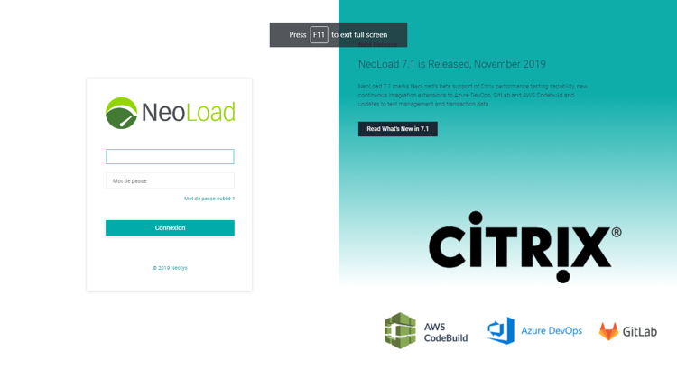

1. Activate your license in NeoLoad

1. Click on the ```resource``` menu option and then the ```subscription``` tab

    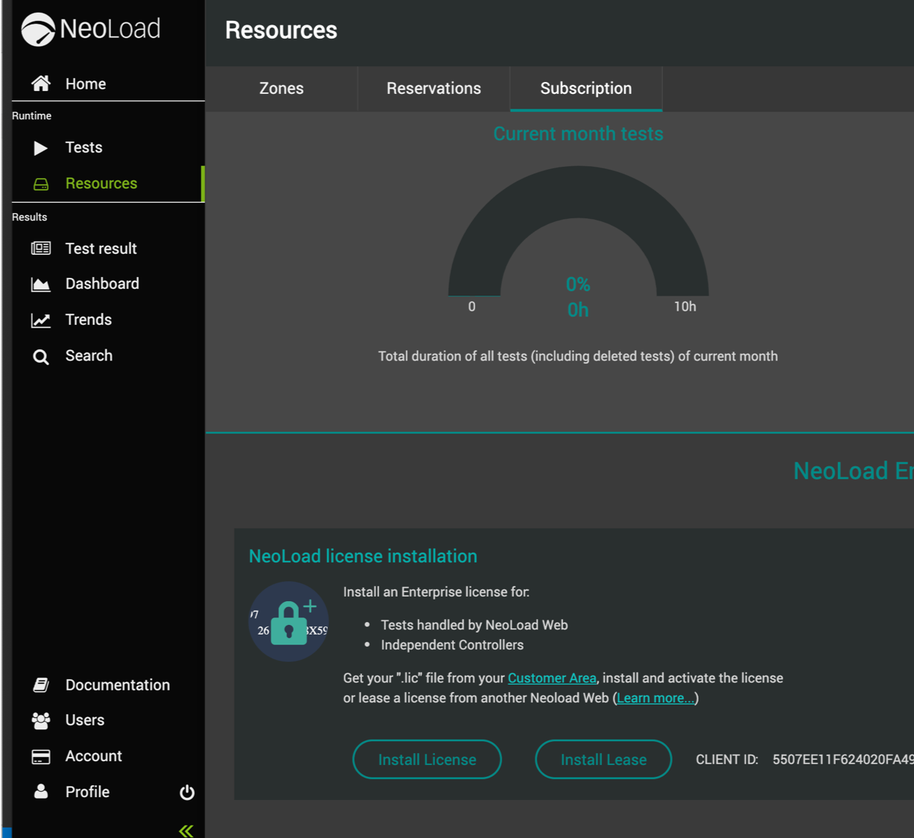

1. Click on the button Install button.  Use the file chooser to pick the license file you downloaded earlier.  Once uploaded, you should a valid license as shown here.

    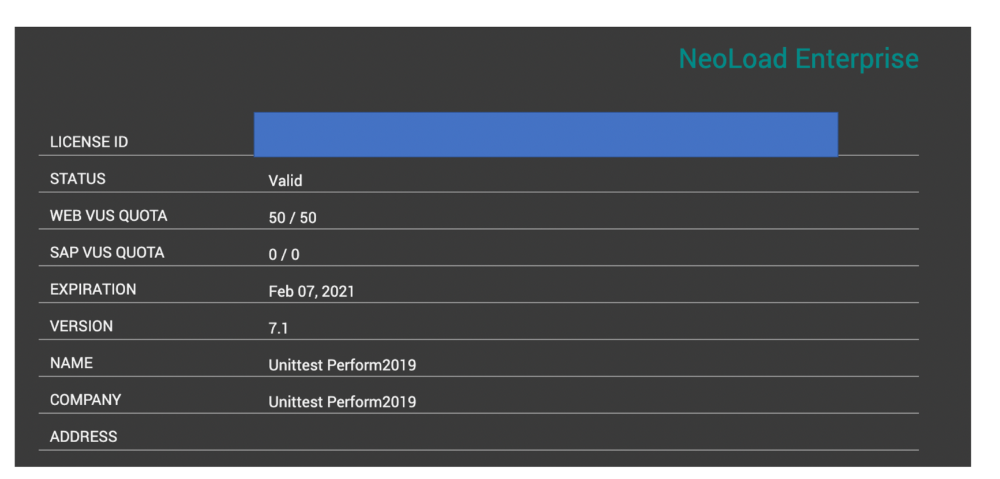

## Neoload on Jenkins Overview

Below is the workflow for tests initiated by Jenkins pipelines.

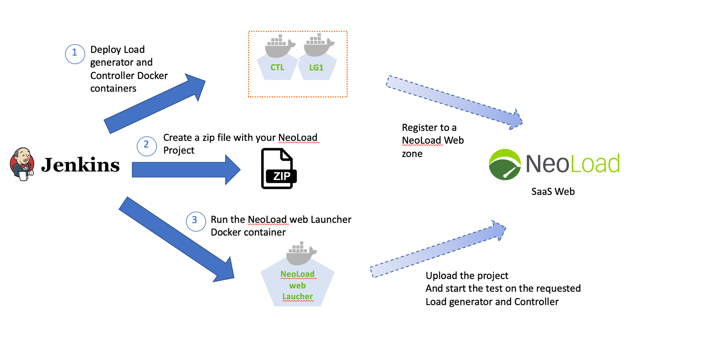 

Let us review a couple of key areas of Neoload

**Resources**

Click the resource menu to view the Load Testing load testing infrastructure.  Since our tests are run using "on-demand" controllers and generators you will not see anything just yet.  But while a test is running, the Controller and LoadGenerators will spin up and register themselves in the "default" zone as shown below

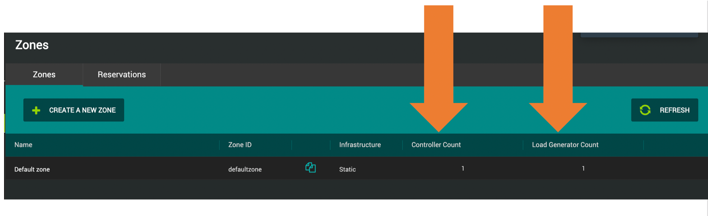

**Tests**

Click the resource menu to view tests that are running test that are finished. We have not run a test yet, but they will appear in the home page as show below.


## Run NeoLoad tests using Jenkins

The picture below shows the setup for the lab environment.

1. We will use the same sample application and scripts for Dynatrace events and deploying the application as done in the previous labs

1. Neoload generator and controller "on-demand" Docker container will run on the lab VM

1. NeoLoad SaaS interacts with the NeoLoad process on the VM. NeoLoad SaaS will do test orchestration, allow for real-time monitoring, and retain test history.

    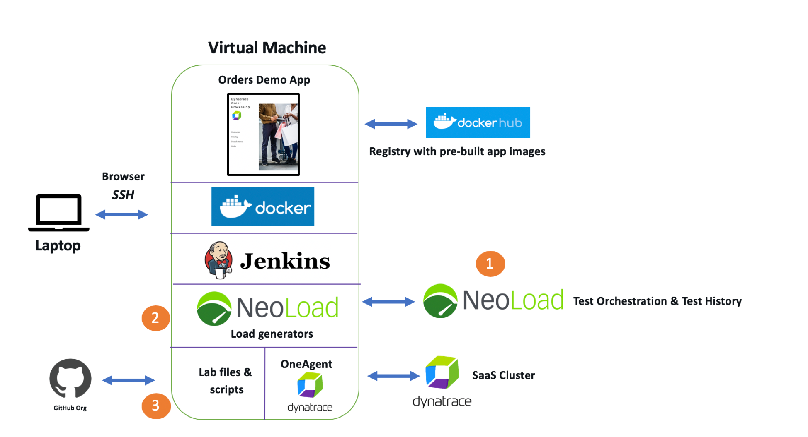

1. Log into Jenkins and navigate to the "Lab 5" task.

1. Navigate to Catalog --\&gt; Catalog and choose the "build with parameters" option.  The anomonly rule option will set the threshold in Dynatrace for the test and then remove it once the test is complete.

    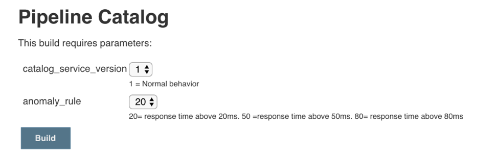

1. As the test runs, you will see the status as shown below.

    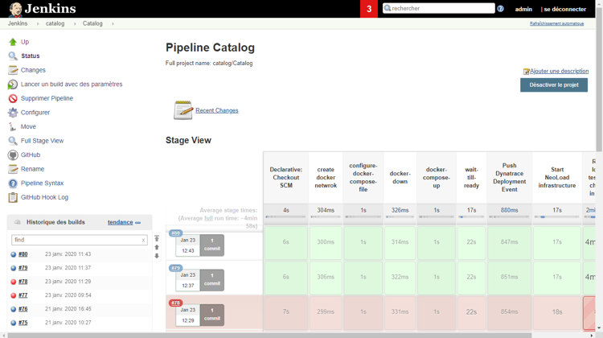

1. Open Dynatrace.

    * Click on "Transaction and Services" and open the "catalog" service.
    * Notice how Neoload automatically tagged the service with the "neoload-catalog" tag.
    * Now click on the database and open it up.  You will see that it too got the "neoload-catalog" tag. This is because neoload automatically determined the dependencies using the Dyantrace API.

    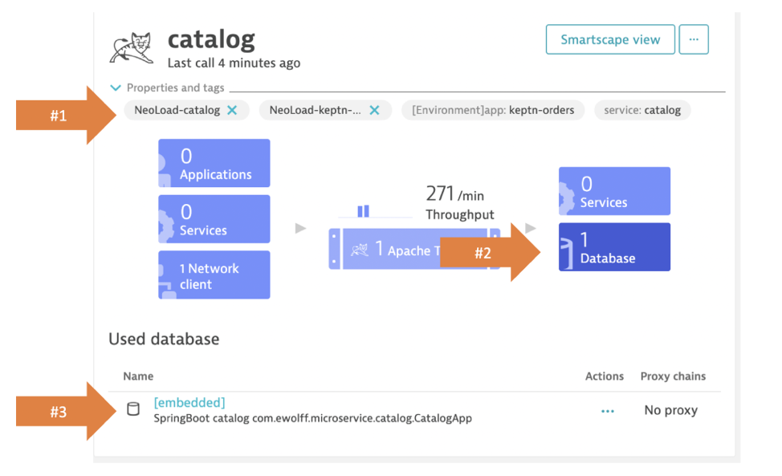

1. On the catalog service, click the to ```view dynamic requests```. Click in the request named: ```catalogload_actions.add+item.:/form.html```  -- this will add it as a filter in the chart

1. How click on the time-frame of the test to have that be the time filter

1. Expand the diagnostics tools section by clicking on the "more"

1. Click on methods hot spots

    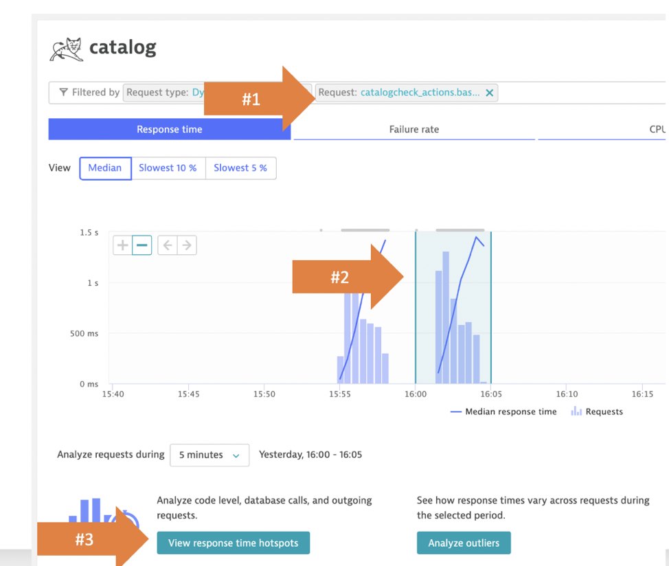

1. On the Dynatrace left side menu, choose the "Create custom chart" option.  On the chart.

    * choose category = request
    * Metric = request duration

1. Finally, Choose the pin to dashboard button and choose the create new dashboard option so you can have this chart saved.


## Review NeoLoad Results

1. In Neoload web, goto the "tests" section and open the test we just started.

    * The overview tab shows all the global statistics metrics.  Global statistics are the metrics sent to Dynatrace
    * The values tab shows statistics by type of NeoLoad entity (Transaction, Page, Request, Counter)
    * The events tab shows all the errors: Assertions errors, SLA, Monitoring alerts

    

1. Create a custom dashboard

    Neoload charts can show data from both test request and monitoring data. To make a chart

    * click on the "Dashboard" menu
    * Select the test from the dropdown
    * Click the "+ add" button on the top to add a new graph
    * In the data sources section, choose the "user path" metrics
    * In the "statistics" section drag and drop a metric such as these into the graph
        * Hit/s
        * Transaction/S of a specific transaction
        * Response time
        * Time to First bytes

    * The graph will look something like this

        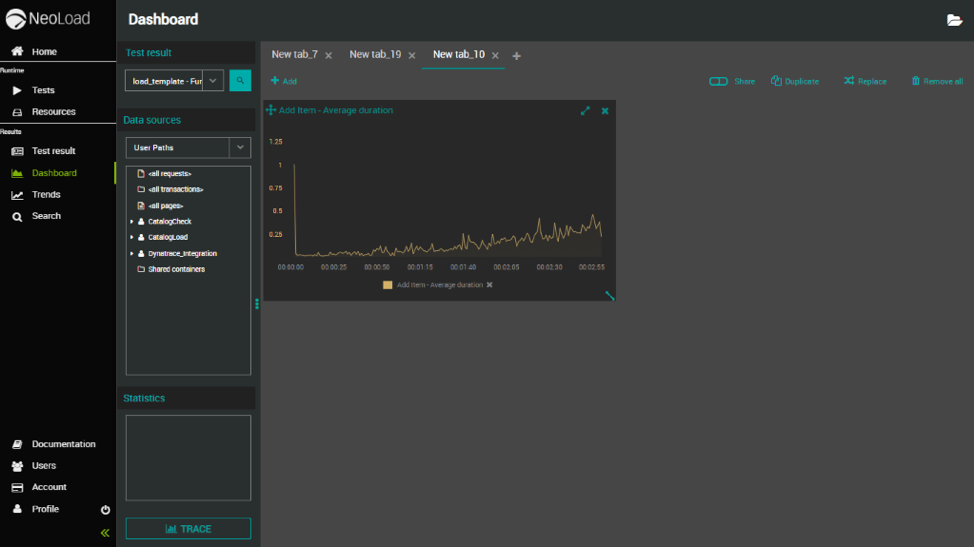

    You can also choose any infrastructure metrics collected by a NeoLoad integration or a core monitoring module of NeoLoad.

    To do this
    * In the "data sources" section, choose the "monitors" option.
    * Expand the "External Data" section the find "Dynatrace" as shown below and just drag and drop one of the metrics to the graph

## Run Tests with SLAs

Continue to try these test scripts and exercises:

1. Components testing with SLA

    * In Jenkins, run the pipeline Catalog/Catalog-with-SLA
    * Once the Jenkins build is finished. In Dynatrace, Click on the test event added by NeoLoad on the services tagged ```service:catalog```
    * Click on the Neoload web url to look at the results in NeoLaod Web
    * Create a graph with the _number of process _utilized by the _catalog service_
    * What is the status of the SLA?

1. End2End testing

    * In Jenkins, run the pipeline ```End2End/End2End-with-SLA```
    * In Neoload, review the SLA Status for the test
    * In Dynatrace, where there any Problems opened by Dynatrace on the service tagged: ```_[Environment]__app:keptn-orders_```

# Lab 5 Checklist

In this lab, you should have completed the following:

:white_check_mark: Learned the NeoLoad Platform and reviewed tests within the NeoLoad SaaS Web UI

:white_check_mark: Run NeoLoad tests using Jenkins

:white_check_mark: Review Neoload results and the various Dynatrace integrations

<hr>

:arrow_backward: [Previous Lab](../lab4)